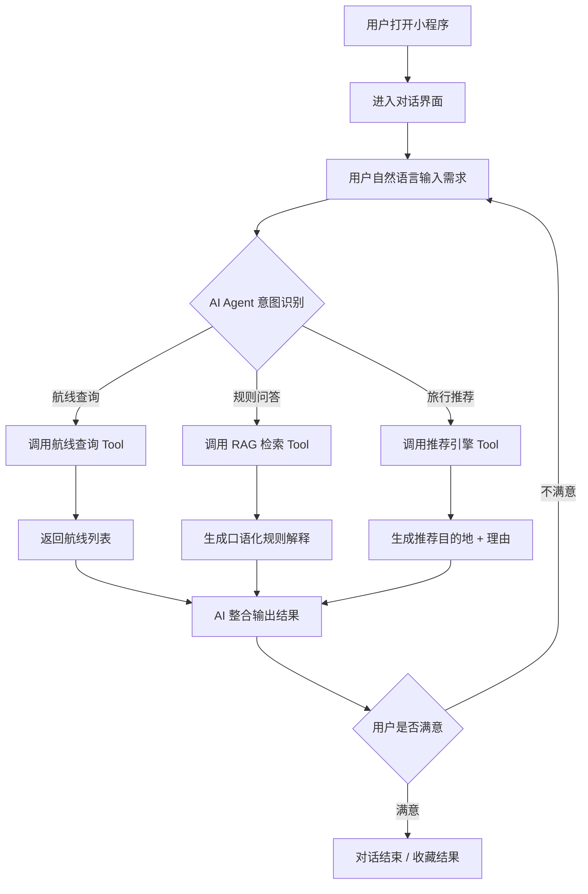
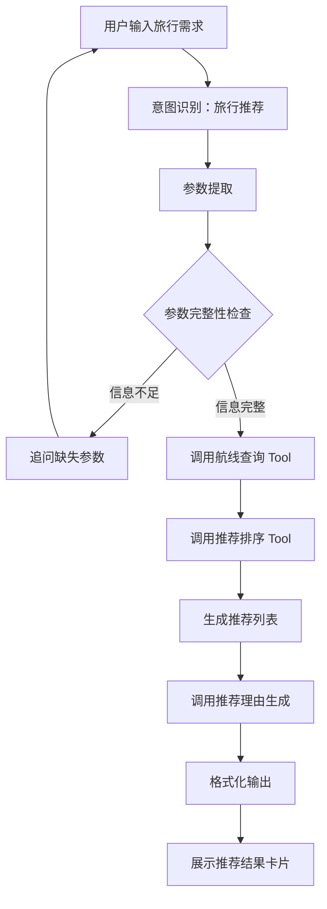
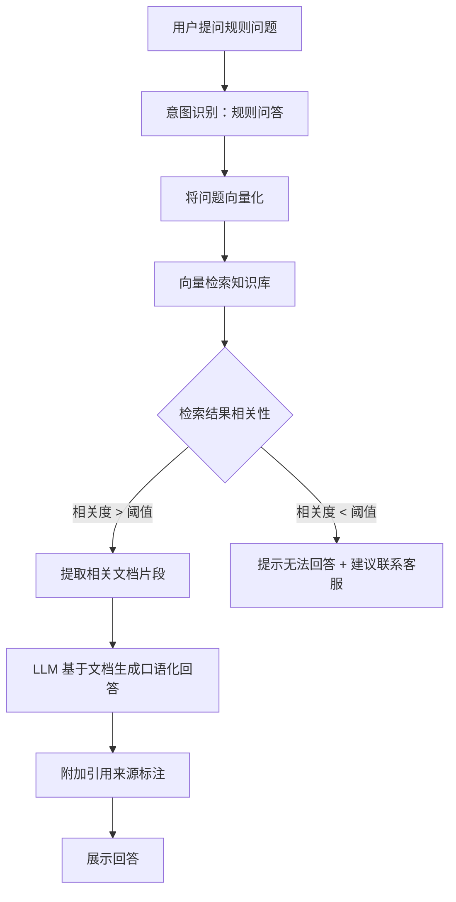
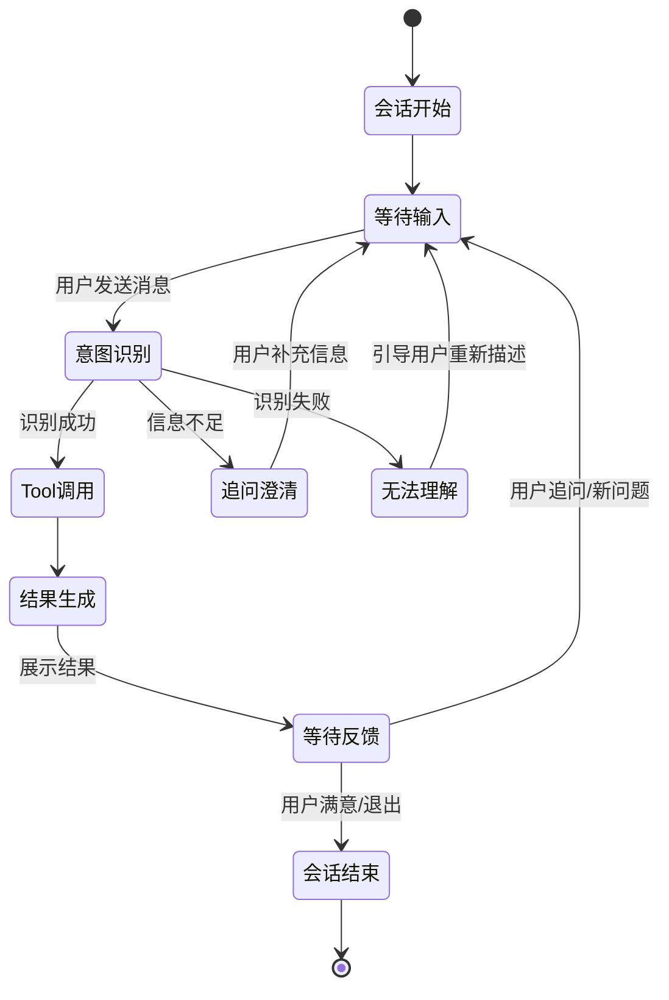
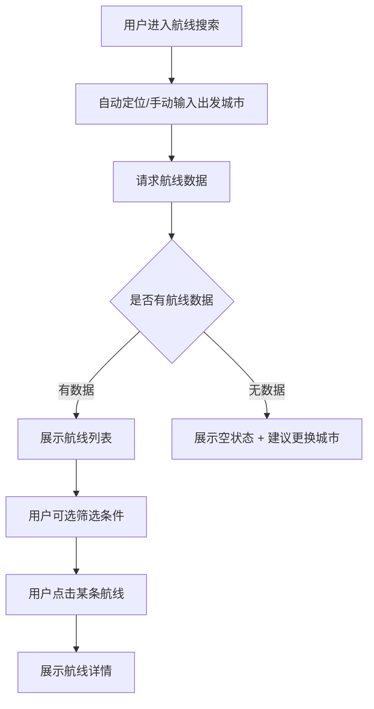
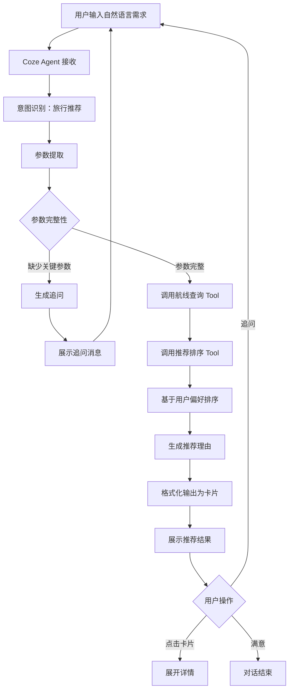
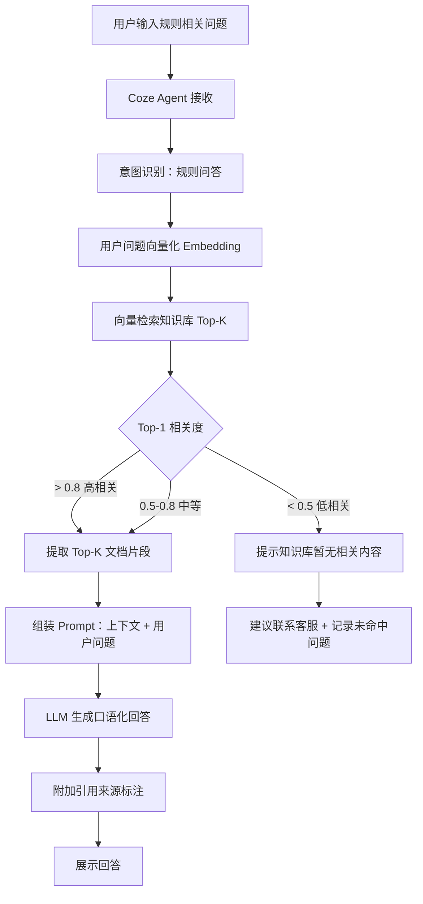
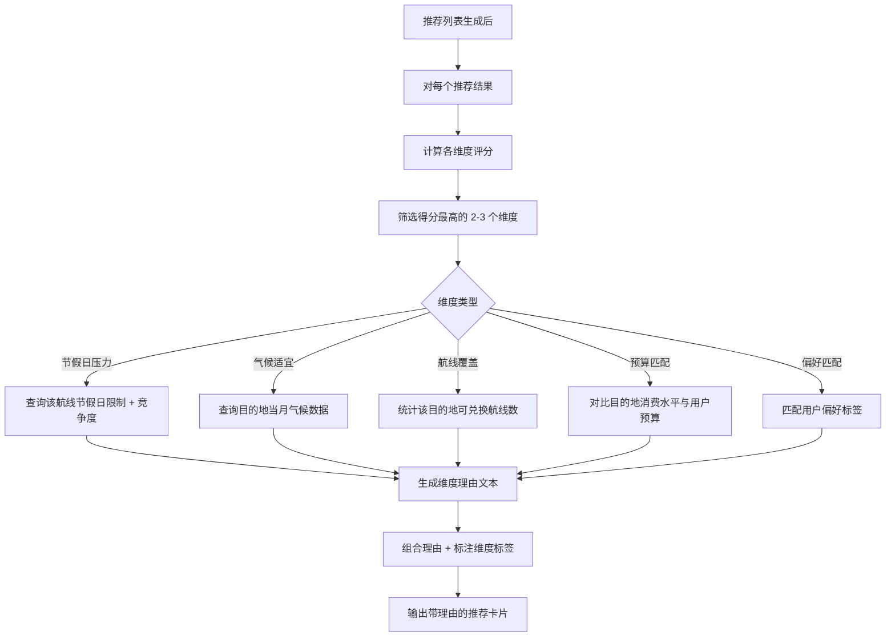

# AI随心飞助手 产品需求文档（PRD）

版本号：V1.0.0

| 版本 | 时间 | 修订人 | 备注 |
|------|------|--------|------|
| V1.0.0 | 2026/05/12 | PM  | 基于原始需求文档 V1.0 创建 |

---

## 一、概述

### 1.1 产品概述及目标

#### 1.1.1 背景介绍

"海航666随心飞"产品规则复杂、航线信息分散，用户在实际使用中存在以下痛点：

- **信息不对称**：不知道能飞哪里、不知道什么时候适合飞
- **规则理解门槛高**：官方兑换规则、改签规则、节假日限制等需频繁查阅，理解成本高
- **决策缺乏辅助**：当前竞品（如"机票神操作"、flight-map）仅提供航线查询和可视化，缺少 AI 自然语言交互和个性化决策能力

市场上已有的航旅工具停留在"信息展示"层面，用户仍需自行筛选、理解规则、做出决策。这为 AI 驱动的决策助手创造了明确的市场机会。

#### 1.1.2 产品概述

**AI随心飞助手**是一款基于 AI Agent 的航旅决策助手，以微信小程序为载体。用户通过自然语言输入旅行需求，AI 自动完成航线查询、规则解释、个性化推荐，帮助用户从"查询"到"决策"一站式完成。

核心差异化：**从"查询工具"升级为"决策助手"**。

#### 1.1.3 产品目标

**业务目标**

| 目标 | 指标 | 目标值 | 达成时间 |
|------|------|--------|---------|
| 验证 AI 航旅决策可行性 | 用户自然语言对话完成率 | ≥ 60% 用户完成完整对话闭环 | 上线后 1 个月 |
| 降低用户决策成本 | 单次决策平均耗时 | < 2 分钟（传统方式 > 10 分钟） | 上线后 1 个月 |
| 提升用户活跃度 | 周活跃率 | ≥ 30% | 上线后 3 个月 |
| 验证 RAG 能力 | 规则问答准确率 | ≥ 85% [假设] | 上线后 1 个月 |

**用户目标**

| 目标用户 | 用户目标 | 衡量指标 |
|---------|---------|---------|
| 随心飞用户 | 快速了解可兑换航线 | 航线查询到结果 < 3s |
| 随心飞用户 | 理解复杂的兑换规则 | 规则问答满意度 ≥ 4.0/5.0 |
| 随心飞用户 | 获得个性化旅行推荐 | 推荐采纳率 ≥ 40% [假设] |

#### 1.1.4 目标用户

| 角色 | 描述 | 核心诉求 |
|------|------|---------|
| 随心飞用户 | 已购买海航666随心飞产品的用户 | 快速找到可兑换航线、理解规则、获得旅行建议 |
| 潜在用户 | 考虑购买随心飞产品但犹豫的用户 | 了解航线覆盖情况、评估是否值得购买 |

**用户特点**：
- 偏好低成本旅行
- 经常临时决策（说走就走）
- 对节假日兑换敏感
- 不愿阅读复杂官方规则文档
- 希望快速获得推荐结果

### 1.2 名词说明

| 名词 | 说明 |
|------|------|
| 随心飞 | 海航推出的固定价格、多次兑换的机票产品 |
| 兑换 | 使用随心飞权益预订机票的行为 |
| RAG | 检索增强生成（Retrieval-Augmented Generation），基于知识库检索相关内容辅助 AI 生成回答 |
| Agent | AI 智能体，能自动理解意图、调用工具、完成多步骤任务 |
| Tool Calling | AI 调用外部工具（如航线查询、规则检索）的能力 |
| Coze | 字节跳动旗下的 AI Agent 开发平台 |

### 1.3 角色及权限

| 角色 | 权限范围 | 数据范围 |
|------|---------|---------|
| 普通用户 | 航线查询、AI 对话、个性化推荐、规则问答 | 仅本人的对话记录和历史搜索 |
| 系统管理员 | 知识库管理、航线数据维护、对话日志查看 | 全部数据 [假设] |

### 1.4 文档阅读对象

| 对象 | 关注内容 |
|------|---------|
| 前端研发 | 功能需求（第三章）、界面交互、全局规则 |
| AI/后端研发 | Agent 工作流、Tool Calling 设计、RAG 方案、系统集成 |
| UI/UX | 界面交互、全局规则、异常状态展示 |
| 测试 | 异常流程、验收标准（第五章） |
| 产品/运营 | 产品目标、埋点方案、版本规划 |

---

## 二、产品描述

### 2.1 产品需求描述

本产品面向海航随心飞用户，提供基于自然语言的 AI 航旅决策服务。核心能力包括：

- **航线搜索**：根据出发城市查询可飞目的地和可兑换航线
- **AI 个性化推荐**：基于用户自然语言输入（出发地、时间、预算、偏好），生成个性化目的地推荐
- **AI 规则解释助手（RAG）**：基于海航官方规则文档构建知识库，支持自然语言问答
- **AI 推荐理由解释**：对每条推荐结果输出可解释的推荐理由

**不做什么（V1.0 范围外）**：
- 不提供实际订票/兑换功能（仅做决策辅助，下单跳转官方渠道）
- 不提供社交/社区功能
- 不支持多航司随心飞产品对比
- 不提供实时价格查询（使用航线静态数据）

### 2.2 产品整体流程

#### 2.2.1 主流程



#### 2.2.2 子流程：AI 个性化推荐



#### 2.2.3 子流程：RAG 规则问答



#### 2.2.4 状态转换图：对话会话



### 2.3 全局说明

#### 2.3.1 全局异常处理

| 异常场景 | 处理方式 | 提示文案 |
|---------|---------|---------|
| 网络异常 | 展示网络错误插画 + 重试按钮 | "网络连接异常，请检查网络后重试" |
| 服务超时 | 展示超时提示 + 重试按钮 | "响应时间较长，请稍后重试" |
| AI 服务异常 | 展示兜底文案 + 客服入口 | "AI 助手暂时不可用，请稍后再试" |
| 航线数据为空 | 展示空状态 | "暂未找到相关航线信息" |
| 知识库检索无结果 | 展示提示 + 人工客服入口 | "我暂时无法回答这个问题，建议联系海航客服确认" |
| 小程序后台被杀 | 恢复上次对话上下文 | 无提示，静默恢复 [假设] |

#### 2.3.2 对话列表规则

| 规则项 | 说明 |
|--------|------|
| 会话列表 | 按最近对话时间倒序排列 |
| 会话标题 | 自动提取首条用户输入作为标题（截断 20 字） |
| 空状态 | 首次进入展示欢迎语 + 输入引导 |
| 历史对话 | 支持查看历史对话记录，保留最近 30 天 [假设] |

#### 2.3.3 全局交互

| 场景 | 交互方式 |
|------|---------|
| AI 生成中 | 显示逐字输出动画 / 思考中状态 |
| 推荐结果 | 以卡片形式展示，支持左右滑动浏览 |
| 航线结果 | 列表形式展示，支持点击查看详情 |
| 操作成功 | 收藏成功 Toast 提示 |
| 加载中 | 骨架屏 / loading 动画 |
| 空状态 | 插画 + 引导文字 |
| 输入框 | 支持文字输入 + 语音输入 [待确认] |
| 错误重试 | 网络/服务错误提供重试按钮 |

### 2.4 产品版本规划（里程碑）

| 版本 | 范围 | 计划时间 | 状态 |
|------|------|---------|------|
| V0.1 | 微信小程序框架 + 航线搜索 | 已完成 | 已上线 |
| V0.2 | AI 个性化推荐 + Coze Agent 接入 | 已完成 | 已上线 |
| V1.0 | AI 规则解释助手（RAG）+ 推荐理由生成 | [待确认] | 开发中 |
| V1.1 | AI 行程规划 + 多轮对话优化 | [待确认] | 规划中 |
| V2.0 | 多航司随心飞支持 + 价格对比 | [待确认] | 远期 |

### 2.5 产品框架

```
AI随心飞助手
├── 对话交互层（首页）
│   ├── AI 对话界面
│   ├── 推荐结果卡片
│   ├── 航线结果列表
│   └── 规则问答展示
├── 航线搜索模块
│   ├── 出发城市选择
│   ├── 目的地筛选
│   └── 航线详情
├── AI Agent 层（Coze）
│   ├── 意图识别
│   ├── Tool Calling
│   └── 结果生成
├── 知识库层
│   ├── 航线数据
│   ├── 规则文档（RAG）
│   └── FAQ 库
└── 用户模块
    ├── 对话历史
    ├── 收藏记录
    └── 个人设置
```

### 2.6 功能清单

| 模块 | 功能 | 优先级 | 版本 | 说明 |
|------|------|--------|------|------|
| 航线搜索 | 出发城市选择 | P0 | V0.1 | 支持搜索和定位 |
| 航线搜索 | 目的地查询 | P0 | V0.1 | 按城市筛选 |
| 航线搜索 | 可兑换航线展示 | P0 | V0.1 | 列表 + 详情 |
| AI 对话 | 自然语言输入 | P0 | V0.2 | 文字输入 |
| AI 对话 | 意图识别 | P0 | V0.2 | 航线查询/推荐/规则问答 |
| AI 对话 | 个性化推荐 | P0 | V0.2 | 基于偏好生成推荐 |
| AI 对话 | 推荐理由解释 | P0 | V1.0 | 每条推荐附带理由 |
| AI 对话 | 多轮对话上下文 | P1 | V1.1 | 支持追问和补充 |
| 规则助手 | 规则知识库构建 | P0 | V1.0 | 海航官方文档入库 |
| 规则助手 | 自然语言规则问答 | P0 | V1.0 | RAG + 口语化回答 |
| 规则助手 | 引用来源标注 | P1 | V1.0 | 展示回答依据 |
| 用户模块 | 对话历史 | P1 | V0.1 | 历史会话列表 |
| 用户模块 | 收藏功能 | P2 | V1.1 | 收藏推荐结果 |
| 行程规划 | AI 行程规划 | P1 | V1.1 | 多天行程建议 |

---

## 三、功能需求（怎么做）

### 3.1 航线搜索

#### 3.1.1 描述
用户选择出发城市，系统展示该城市出发的所有可兑换航线和目的地。

#### 3.1.2 用户故事
```
作为随心飞用户，我希望输入出发城市后能看到所有可飞目的地，以便快速了解我能去哪里。
作为随心飞用户，我希望查看航线的详细信息（航班号、时段、兑换条件），以便判断这条航线是否适合我。
```

#### 3.1.3 前置条件

| 类型 | 条件 |
|------|------|
| 数据依赖 | 航线结构化数据已完成导入 |
| 功能依赖 | 无 |

#### 3.1.4 后置条件
- 搜索记录保存到用户对话历史
- 搜索结果可用于后续推荐流程

#### 3.1.5 界面及交互

| 元素 | 类型 | 必填 | 默认值 | 校验规则 | 操作反馈 |
|------|------|------|--------|---------|---------|
| 出发城市 | 搜索输入框 | 是 | 自动定位城市 | 城市名称校验 | 无匹配时提示"未找到该城市" |
| 航线列表 | 列表 | - | - | - | 每条展示：目的地、航班号、适用时段 |
| 筛选条件 | 下拉/标签 | 否 | 全部 | - | 按区域、热度筛选 |
| 航线详情 | 详情卡片 | 否 | - | - | 点击展开 |

#### 3.1.6 业务流程



#### 3.1.7 异常/分支流程

| 场景 | 触发条件 | 处理方式 | 提示文案 |
|------|---------|---------|---------|
| 城市无航线 | 该出发城市无可兑换航线 | 展示空状态，推荐附近城市 | "当前城市暂无可兑换航线，试试附近城市？" |
| 定位失败 | 获取用户位置失败 | 手动输入城市 | "无法获取位置，请手动选择出发城市" |
| 数据加载超时 | 接口响应 > 3s | 展示 loading + 超时提示 | "加载中…如果长时间无响应请刷新" |
| 搜索无匹配 | 输入城市名无匹配 | 展示空结果 + 推荐附近城市 | "未找到该城市，请检查城市名称" |

#### 3.1.8 数据字典

| 字段名 | 类型 | 必填 | 说明 | 示例值 |
|--------|------|------|------|--------|
| route_id | String(32) | 是 | 航线唯一标识 | "RT20260101" |
| departure_city | String(20) | 是 | 出发城市 | "北京" |
| departure_airport | String(30) | 是 | 出发机场 | "北京首都国际机场" |
| arrival_city | String(20) | 是 | 到达城市 | "三亚" |
| arrival_airport | String(30) | 是 | 到达机场 | "三亚凤凰国际机场" |
| airline | String(10) | 是 | 航司 | "海航" |
| flight_season | Enum | 是 | 适用时段：0-全年 1-夏秋 2-冬春 | 1 |
| exchange_limit | String(50) | 否 | 兑换限制说明 | "节假日不适用" |
| is_active | Boolean | 是 | 是否有效 | true |

### 3.2 AI 个性化推荐

#### 3.2.1 描述
用户在对话界面通过自然语言描述旅行需求（出发地、时间、预算、偏好），AI 自动提取参数并生成个性化目的地推荐列表，附带推荐理由。

#### 3.2.2 用户故事
```
作为随心飞用户，我希望用一句话描述我的旅行需求，以便快速获得符合我偏好的目的地推荐。
作为随心飞用户，我希望看到每个推荐目的地的推荐理由，以便理解为什么这个地方适合我。
作为随心飞用户，我希望 AI 能理解我的模糊表达（如"想去暖和的地方"），以便我不需要精确描述也能获得推荐。
```

#### 3.2.3 前置条件

| 类型 | 条件 |
|------|------|
| 数据依赖 | 航线结构化数据可用 |
| 功能依赖 | Coze Agent 工作流已部署并接入 |
| 数据依赖 | 目的地基础信息库（气候、热度、预算等级等）已构建 [假设] |

#### 3.2.4 后置条件
- 推荐结果存入对话上下文，支持后续追问
- 推荐交互事件上报埋点

#### 3.2.5 界面及交互

| 元素 | 类型 | 必填 | 默认值 | 校验规则 | 操作反馈 |
|------|------|------|--------|---------|---------|
| 对话输入框 | 文本输入 | 是 | 占位："周末想去哪里？" | 1-500 字 | 发送后显示发送状态 |
| 推荐结果卡片 | 卡片列表 | - | - | - | 每张卡片含：城市名、推荐指数、理由摘要、航线数 |
| 卡片详情 | 展开面板 | 否 | - | - | 点击展开：详细理由、航线列表、最佳季节 |
| 追问入口 | 快捷按钮 | 否 | - | - | "还有别的吗？"、"能具体说说为什么推荐这里吗？" |

#### 3.2.6 业务流程



#### 3.2.7 异常/分支流程

| 场景 | 触发条件 | 处理方式 | 提示文案 |
|------|---------|---------|---------|
| 意图识别失败 | 用户输入与旅行推荐无关 | 降级为通用对话 | "我目前主要擅长旅行推荐和航线查询，可以试试问我'周末去哪玩'？" |
| 无匹配航线 | 偏好条件过于严格 | 放宽条件重新推荐 | "按你的偏好暂时没找到完美匹配，以下是一些接近的选择～" |
| 输入过于简短 | 参数不足以做出推荐 | 追问关键参数 | "你想要从哪个城市出发呢？大概什么时间？" |
| Agent 超时 | Coze 响应 > 10s | 展示超时提示 | "正在为你仔细规划中，请稍等一下…" [假设] |
| 重复推荐 | 用户连续两次输入相同查询 | 更换推荐角度/补充新推荐 | "上次推荐了 A 和 B，换个思路，C 也很适合你…" |

#### 3.2.8 数据字典：推荐请求

| 字段名 | 类型 | 必填 | 说明 | 示例值 |
|--------|------|------|------|--------|
| user_input | String(500) | 是 | 用户原始输入 | "周末从北京出发，预算低，适合散心" |
| departure_city | String(20) | 否 | AI 提取的出发城市 | "北京" |
| travel_date | Date | 否 | AI 提取的出行日期 | "2026-05-16" |
| budget_level | Enum | 否 | 预算等级：0-低 1-中 2-高 | 0 |
| preference_tags | Array | 否 | 偏好标签 | ["散心","自然风光"] |
| session_id | String(32) | 是 | 会话标识 | "SES20260512" |

#### 3.2.9 数据字典：推荐结果

| 字段名 | 类型 | 必填 | 说明 | 示例值 |
|--------|------|------|------|--------|
| recommend_id | String(32) | 是 | 推荐结果标识 | "REC20260512" |
| city | String(20) | 是 | 推荐城市 | "昆明" |
| score | Integer(0-100) | 是 | 推荐指数 | 85 |
| reasons | Array | 是 | 推荐理由列表 | ["气候宜人","航线覆盖多"] |
| route_count | Integer | 是 | 可兑换航线数 | 3 |
| best_season | String(20) | 否 | 最佳出行季节 | "春/秋季" |

### 3.3 AI 规则解释助手（RAG）

#### 3.3.1 描述
基于海航官方规则文档构建向量知识库。用户以自然语言提问（如"国庆期间可以兑换吗？"），系统检索相关规则文档片段，结合 LLM 生成口语化的准确回答，并标注引用来源。

#### 3.3.2 用户故事
```
作为随心飞用户，我希望用口语提问就能得到准确的规则解释，以便不需要翻阅复杂的官方文档。
作为随心飞用户，我希望 AI 回答能标注引用来源，以便我核实信息的准确性。
作为随心飞用户，我希望 AI 回答用大白话解释，以便我快速理解那些拗口的官方条文。
```

#### 3.3.3 前置条件

| 类型 | 条件 |
|------|------|
| 数据依赖 | 海航官方规则文档已采集并入库（兑换规则、改签规则、节假日限制等） |
| 数据依赖 | 文档已分段并向量化存储 |
| 功能依赖 | RAG 检索管道已搭建（Embedding + 向量数据库 + LLM） |
| 功能依赖 | Coze 知识库/Firecrawl 或其他 RAG 组件已配置 [假设] |

#### 3.3.4 后置条件
- 问答记录存入对话历史
- 检索命中率和回答准确率上报监控

#### 3.3.5 界面及交互

| 元素 | 类型 | 必填 | 默认值 | 校验规则 | 操作反馈 |
|------|------|------|--------|---------|---------|
| 问题输入框 | 文本输入 | 是 | 占位："例如：国庆节能兑换吗？" | 1-300 字 | 发送后展示"查询中"状态 |
| 回答气泡 | 消息气泡 | - | - | - | 口语化回答 + 引用来源 |
| 引用折叠 | 折叠面板 | 否 | 折叠 | - | 点击展开："参考来源：XX规则第X条" |
| 追问建议 | 快捷按钮 | 否 | - | - | 如："能改签吗？"、"儿童票呢？" |
| 无法回答兜底 | 消息 + 按钮 | - | - | - | "建议咨询海航官方客服" + 客服入口 |

#### 3.3.6 业务流程



#### 3.3.7 异常/分支流程

| 场景 | 触发条件 | 处理方式 | 提示文案 |
|------|---------|---------|---------|
| 知识库检索无结果 | 所有文档片段相关度 < 0.5 | 兜底回答 + 客服入口 | "这个我暂时还不太确定，建议联系海航客服确认，他们会给你最准确的答案～" |
| 多政策版本冲突 | 检索到新旧版本矛盾信息 | 以最新版本为准 + 标注 | "根据最新政策…（可能与此前规则有所不同）" [假设] |
| 问题超出范围 | 用户问非海航相关问题 | 礼貌拒绝 + 引导 | "我主要解答随心飞相关问题，试试问我兑换规则吧！" |
| 文档解析异常 | 文档格式无法正确分段 | 降级为全文检索 | （静默降级，回答质量可能下降）|

#### 3.3.8 数据字典：知识库文档

| 字段名 | 类型 | 必填 | 说明 | 示例值 |
|--------|------|------|------|--------|
| doc_id | String(32) | 是 | 文档唯一标识 | "DOC001" |
| doc_name | String(100) | 是 | 文档名称 | "海航666随心飞兑换规则V2.0" |
| doc_version | String(10) | 是 | 版本号 | "V2.0" |
| doc_source | String(200) | 是 | 来源 URL/文件路径 | "https://xxx.com/rules" |
| chunk_id | String(32) | 是 | 文档分块标识 | "DOC001_CHK003" |
| chunk_content | Text | 是 | 分块文本内容 | "随心飞产品在法定节假日期间不支持兑换…" |
| embedding | Vector(1536) | 是 | 文本向量 | [0.023, -0.451, ...] |
| effective_date | Date | 是 | 生效日期 | "2026-01-01" |
| is_active | Boolean | 是 | 是否当前有效版本 | true |

#### 3.3.9 数据字典：问答记录

| 字段名 | 类型 | 必填 | 说明 | 示例值 |
|--------|------|------|------|--------|
| qa_id | String(32) | 是 | 问答记录标识 | "QA20260512001" |
| user_question | String(500) | 是 | 用户原始问题 | "国庆节能兑换吗" |
| top_chunks | Array | 是 | 检索命中的文档片段 ID | ["DOC001_CHK003"] |
| relevance_score | Float | 是 | Top-1 相关度 | 0.92 |
| ai_answer | Text | 是 | AI 生成回答 | "根据最新规则，国庆节期间…" |
| user_feedback | Enum | 否 | 用户反馈：0-无 1-有用 2-无用 | 1 |
| created_at | DateTime | 是 | 问答时间 | "2026-05-12 14:30:00" |

### 3.4 AI 推荐理由解释

#### 3.4.1 描述
在输出推荐结果时，AI 同时生成可解释的推荐理由，告诉用户"为什么推荐"。理由覆盖多维度：节假日兑换压力、气候适宜度、航线覆盖量、预算匹配度、旅行偏好匹配等。

#### 3.4.2 用户故事
```
作为随心飞用户，我希望知道 AI 为什么推荐某个目的地，以便我对推荐结果有信心。
作为随心飞用户，我希望推荐理由不是泛泛而谈，而是结合我的偏好和实际情况，以便做更理性的决策。
```

#### 3.4.3 前置条件

| 类型 | 条件 |
|------|------|
| 功能依赖 | 3.2 AI 个性化推荐已生成推荐列表 |
| 数据依赖 | 目的地特征库：气候数据、节假日兑换压力评估、价格等级等 |

#### 3.4.4 后置条件
- 推荐理由随推荐结果一同展示

#### 3.4.5 界面及交互

| 元素 | 类型 | 必填 | 默认值 | 校验规则 | 操作反馈 |
|------|------|------|--------|---------|---------|
| 推荐理由标签 | 标签组 | 是 | - | - | 每条理由一个标签（如"气候宜人"、"低兑换压力"） |
| 详细理由 | 文本 | 是 | - | - | 1-2 句口语化解释 |
| 理由维度图标 | 图标 | 否 | - | - | 气候/价格/航线/节假日各有对应图标 |

#### 3.4.6 业务流程



#### 3.4.7 异常/分支流程

| 场景 | 触发条件 | 处理方式 | 提示文案 |
|------|---------|---------|---------|
| 理由生成失败 | LLM 输出格式异常 | 降级为仅展示推荐列表，不带理由 | 不显示理由区域 |
| 所有维度评分接近 | 无明显突出优点 | 以"综合均衡"为理由 | "各方面表现均衡，是个稳妥的选择" |
| 气候数据缺失 | 目的地气候数据未覆盖 | 跳过气候维度 | 不展示气候相关理由 |

---

## 四、非功能需求（注意事项）

### 4.1 安全与合规需求

| 需求 | 说明 |
|------|------|
| 数据传输 | 全站 HTTPS，API 请求加密传输 |
| 用户隐私 | 对话记录脱敏处理，不存储用户精确位置、手机号等敏感信息 [假设] |
| 知识库合规 | 仅使用海航官方公开文档作为 RAG 数据源，不爬取未授权内容 |
| AI 生成内容免责 | 在对话界面底部展示免责声明："AI 回答仅供参考，以海航官方最新规则为准" |
| 微信小程序合规 | 遵循《微信小程序平台运营规范》，内容不涉及诱导分享、虚假宣传 |
| 个人信息保护 | 遵循《个人信息保护法》，最小化收集原则，提供隐私政策入口 |

### 4.2 统计需求（埋点）

#### 4.2.1 页面级埋点

| 事件名 | 触发时机 | 属性 | 说明 |
|--------|---------|------|------|
| page_view_chat | 进入对话首页 | page_name, session_id, is_new_user | PV/UV 统计 |
| page_view_routes | 进入航线搜索页 | page_name | 航线页面 PV |
| page_view_history | 进入历史记录页 | page_name | 历史页面 PV |

#### 4.2.2 操作级埋点

| 事件名 | 触发时机 | 属性 | 说明 |
|--------|---------|------|------|
| chat_send | 用户发送消息 | session_id, input_length, intent_type | 对话活跃度 |
| recommend_view | 推荐结果展示 | session_id, recommend_count, response_time_ms | 推荐使用量 |
| recommend_click | 点击推荐卡片 | session_id, city_name, rank_position | 推荐点击率 |
| recommend_reason_expand | 展开推荐理由 | session_id, city_name | 理由关注度 |
| route_search | 航线搜索 | departure_city, result_count | 搜索行为 |
| route_detail_view | 查看航线详情 | route_id, departure_city, arrival_city | 详情关注度 |
| rag_query | 规则问答 | session_id, question_length, relevance_score | RAG 使用量 |
| rag_feedback | 回答评价 | qa_id, feedback(useful/useless) | RAG 满意度 |
| rag_fallback | RAG 无法回答 | session_id, question | 知识库覆盖缺口 |
| collection_add | 收藏结果 | session_id, content_type, content_id | 收藏行为 |

#### 4.2.3 异常监控埋点

| 事件名 | 触发时机 | 属性 | 说明 |
|--------|---------|------|------|
| api_error | API 调用异常 | api_name, error_code, error_msg | 接口异常 |
| agent_timeout | Agent 超时 | session_id, agent_name, timeout_ms | Agent 超时 |
| rag_low_relevance | 检索相关度低 | session_id, relevance_score, question | RAG 质量监控 |
| intent_unknown | 意图识别失败 | session_id, user_input | 意图识别能力监控 |

### 4.3 性能需求

| 指标 | 要求 |
|------|------|
| 小程序首屏加载 | < 2s（4G 网络） |
| 航线搜索接口 | P99 < 500ms [假设] |
| AI 对话首字响应 | < 3s（流式输出首字时间）[假设] |
| RAG 检索耗时 | < 1s [假设] |
| 并发支持 | 支持 500 并发用户（MVP 阶段）[假设] |
| 可用性 | 99.5%（MVP 阶段）[假设] |

### 4.4 数据库设计

> [待确认] 需后续与后端研发及 DBA 共同确定，以下为建议设计。

**核心表**

| 表名 | 说明 | 关键字段 |
|------|------|---------|
| routes | 航线基础数据 | route_id, departure_city, arrival_city, airline, is_active |
| route_details | 航线详细信息 | detail_id, route_id, flight_season, exchange_limit |
| knowledge_docs | 知识库文档 | doc_id, doc_name, doc_version, is_active |
| knowledge_chunks | 文档分块 + 向量 | chunk_id, doc_id, content, embedding |
| chat_sessions | 对话会话 | session_id, user_id, created_at, updated_at |
| chat_messages | 对话消息 | message_id, session_id, role, content, intent_type |
| qa_records | RAG 问答记录 | qa_id, user_question, ai_answer, relevance_score, feedback |
| recommend_records | 推荐记录 | recommend_id, session_id, user_input, results_json |
| user_collections | 用户收藏 | collection_id, user_id, content_type, content_id |

### 4.5 系统集成

| 对接系统 | 接口方向 | 协议 | 说明 |
|---------|---------|------|------|
| Coze Agent 平台 | 调用 | HTTP REST / SSE | Agent 工作流执行、流式对话输出 |
| 向量数据库 | 调用 | SDK / HTTP | Embedding 存储与相似度检索（如 Pinecone/Milvus/Coze 内置） |
| Embedding 服务 | 调用 | HTTP REST | 文本向量化（如 OpenAI Embedding / Coze 内置） |
| 微信小程序登录 | 调用 | 微信 SDK | 用户静默登录，获取 openId |
| 海航官网 | 跳转 | - | 用户点击下单时外跳至官方渠道 |

---

## 五、附录（补充文档）

### 5.1 验收标准与测试要点

| 功能 | 验收条件 | 优先级 |
|------|---------|--------|
| 航线搜索 | 输入"北京"，展示北京出发的所有可兑换航线，数据准确 | P0 |
| 航线搜索 | 输入无效城市名"XYZ"，展示空状态 + 引导提示 | P1 |
| 航线搜索 | 网络异常时，展示重试按钮，点击可重新加载 | P1 |
| AI 推荐 | 输入"周末从北京出发预算低适合散心"，返回≥2个目的地推荐 | P0 |
| AI 推荐 | 每个推荐结果附带至少一条具体推荐理由 | P0 |
| AI 推荐 | 输入"出去玩"（信息不足），AI 追问出发城市等关键参数 | P1 |
| AI 推荐 | 推荐卡片可点击展开详情，信息展示完整 | P1 |
| 规则问答 | 输入"国庆节能兑换吗"，返回准确回答 + 引用来源 | P0 |
| 规则问答 | 输入"今天天气怎么样"（无关问题），礼貌引导至航旅话题 | P1 |
| 规则问答 | 知识库更新后，新规则能被检索到（旧版本不出现） | P0 |
| 规则问答 | 回答未命中时，展示客服入口 + 记录问题 | P1 |
| 通用 | 小程序首屏加载时间 < 2s（4G 网络） | P0 |
| 通用 | 对话流式输出，首字响应 < 3s | P0 |
| 通用 | 所有异常场景有对应的用户提示（非白屏/死循环） | P0 |
| 通用 | 免责声明在对话界面持续可见 | P1 |
| 通用 | 隐私政策可访问 | P1 |

---

## 待确认项清单

### 必须确认（阻塞开发）

1. [待确认] V1.0 版本（RAG + 推荐理由）的期望上线时间？→ 见 2.4 版本规划
2. [待确认] 目的地特征数据（气候、消费水平、热度）的数据源是什么？是否需要手工整理？→ 见 3.2.3 前置条件
3. [待确认] Coze 知识库的具体实现方案：使用 Coze 内置知识库还是有独立向量数据库？→ 见 3.3.3 前置条件
4. [待确认] 用户系统方案：是否需要独立的用户体系（注册/登录），还是仅依赖微信静默登录？→ 见 4.5 系统集成

### 建议确认（影响完整度）

5. [待确认] 是否需要支持语音输入？→ 见 2.3.3 全局交互
6. [假设] 对话历史保留 30 天，是否合适？→ 见 2.3.2
7. [假设] 权限控制暂仅区分普通用户和管理员，是否正确？→ 见 1.3
8. [假设] 并发 500 用户、可用性 99.5% 的目标是否合理？→ 见 4.3
9. [待确认] 航线数据更新的频率和方式？（手动导入 vs 自动同步）→ 见 4.5

### 可后续补充

10. [待确认] 是否需要灰度发布策略？比例如何？→ 见 2.4
11. [待确认] 是否需要支持多航司随心飞对比？→ 见 2.1 不做什么
12. [待确认] 数据库选型方案（MySQL/PostgreSQL/其他）→ 见 4.4

---

## 质量自检清单

| # | 检查项 | 标准 | 状态 |
|---|--------|------|------|
| 1 | 背景与目标 | 有业务目标和用户目标，且可量化或可验证 | ✓ |
| 2 | 角色与权限 | 所有角色已列出，权限边界清晰 | ✓ |
| 3 | 主流程 | 有 Mermaid 流程图，主流程完整闭环 | ✓ |
| 4 | 功能模块 | 每个模块有用户故事、前后置条件、界面交互、数据字典 | ✓ |
| 5 | 异常流程 | 每个功能的异常分支已覆盖（网络异常、权限异常、数据异常） | ✓ |
| 6 | 数据字典 | 字段名、类型、必填、说明、示例值 | ✓ |
| 7 | 埋点方案 | 关键页面和操作有埋点定义，事件名和属性已明确 | ✓ |
| 8 | 非功能需求 | 安全、性能、存储、集成至少各写一条 | ✓ |
| 9 | 验收标准 | 每个核心功能有至少一条可执行的验收条件 | ✓ |
| 10 | 待确认项 | 所有假设和信息缺口已标注并汇总 | ✓ |
| 11 | 无空话 | 避免"提升体验"、"优化性能"等无法执行的描述 | ✓ |
| 12 | 版本记录 | 文档头部有版本号、日期、修订人、备注 | ✓ |
