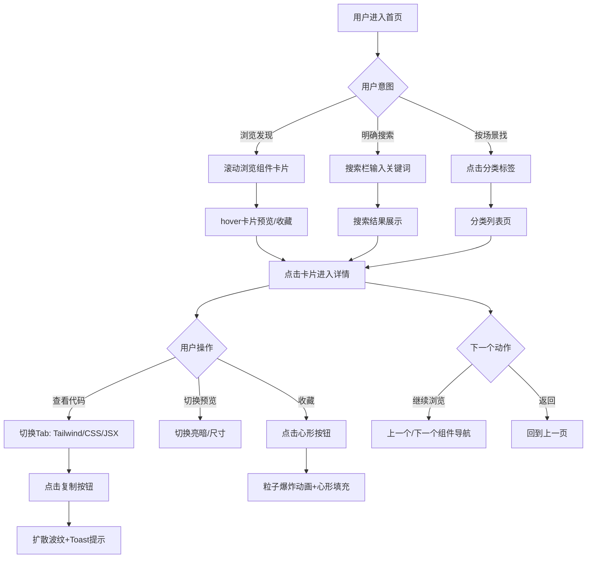
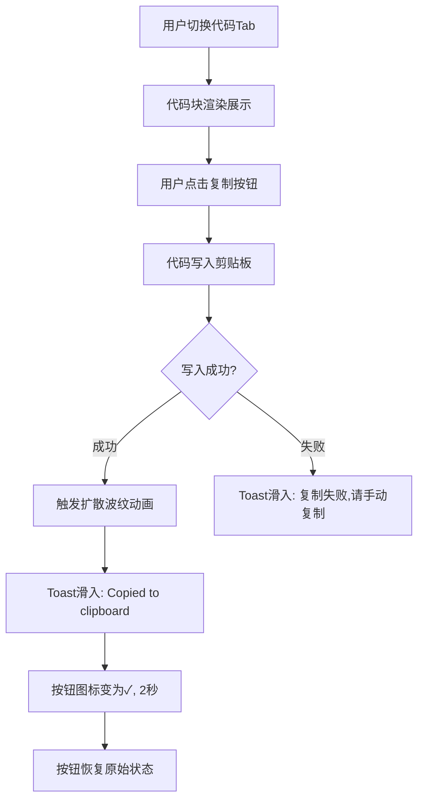
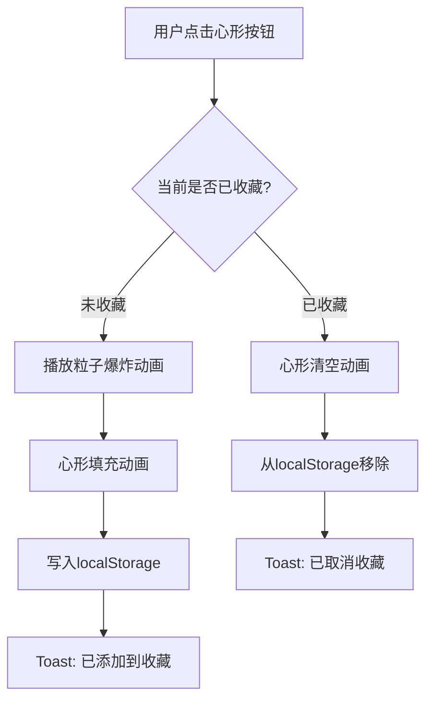

# MedUI 产品需求文档（PRD）

版本号：V1.0.0

| 版本 | 时间 | 修订人 | 备注 |
|------|------|--------|------|
| V1.0.0 | 2026-05-14 | AI PM | 创建 V1.0.0 MVP 版本 |

---

## 一、概述

### 1.1 产品概述及目标

#### 1.1.1 背景介绍

医疗健康是 UI/UX 设计中最被忽视的垂直领域之一。Dribbble 和 Pinterest 上医疗相关的设计参考极度碎片化，设计师搜索成本高，且能找到的只有截图，没有可运行的代码。

市场现状：
- Dribbble 上搜索 "medical UI" 只有泛化的医院官网和健康 App，缺少 B 端 EHR/HIS/LIS 系统设计
- 现有 UI 组件库（Ant Design、shadcn/ui）没有医疗场景专属组件
- 医疗设计师缺少一个"看一眼就知道好的设计长什么样"的垂直参考源
- 医疗 B 端的设计规范（如 NHS Design System）分散在各机构官网，没有聚合


#### 1.1.2 产品概述

MedUI 是一个面向 UI/UX 设计师的医疗场景设计灵感 + 可复制代码的参考工具站。不是传统组件库——不给 npm install，给的是直接复制就能用的 HTML/CSS/JSX 代码片段，配上设计师视角的"为什么这样设计"的说明。

#### 1.1.3 产品目标

**业务目标**

| 目标 | 指标 | 目标值 | 达成时间 |
|------|------|--------|---------|
| 验证概念 | 上线后获得设计师社区反馈 | >20条有效反馈 | 上线后2周 |
| 简历价值 | 作为AI PM实习简历的核心项目 | 至少1次面试中被深入讨论 | 上线后1个月 |
| 个人品牌 | GitHub Star数 | >100 | 上线后3个月 |

**用户目标**

| 目标用户 | 用户目标 | 衡量指标 |
|---------|---------|---------|
| 医疗B端设计师 | 找到EHR/病历/处方的设计参考，直接复制代码 | 单次访问浏览≥3个组件 |
| 健康App设计师 | 参考数据可视化、健康追踪的UI模式 | 在配色方案页停留≥30s |
| 外包设计师 | 快速出一套医疗风格原型给客户看 | 复制代码次数≥2次/访问 |

#### 1.1.4 目标用户

| 角色 | 描述 | 核心诉求 |
|------|------|---------|
| 医疗B端设计师 | 设计EHR/HIS/LIS系统，需要密集数据展示、高容错交互 | 找到"数据密集型界面怎么设计好看"的参考 |
| 健康App设计师 | 设计C端健康/运动/用药App | 找到"有温度但不廉价"的配色和组件 |
| 外包/自由设计师 | 接到医疗项目但不熟悉行业规范 | 快速了解医疗UI的设计模式，直接复用代码 |
| 产品经理 | 画原型或评审时快速找参考 | 看一眼知道某个场景业界主流设计 |

### 1.2 名词说明

| 名词 | 说明 |
|------|------|
| 组件 | 一个独立的UI代码片段，包含HTML结构+CSS样式+可选JS交互，可直接复制使用 |
| 设计说明 | 每个组件附带的设计师视角解释（为什么这样配色、为什么用这个布局），不是技术文档 |
| 配色方案 | 一组医疗场景的配色定义，包含主色/辅色/强调色/字体色/背景色 + 无障碍对比度标注 |
| 预览模式 | 组件详情页中切换亮色/暗色背景和移动端/桌面端尺寸的功能 |

### 1.3 角色及权限

本项目无后端、无用户系统，所有功能均为客户端操作。无角色划分。

| 操作 | 状态 |
|------|------|
| 浏览组件 | 无需登录 |
| 搜索/筛选 | 无需登录 |
| 复制代码 | 无需登录 |
| 收藏组件 | localStorage 客户端存储 |
| 切换亮暗模式 | 客户端偏好 |

### 1.4 文档阅读对象

| 对象 | 关注内容 |
|------|---------|
| 研发（本人/Coze） | 功能需求、数据结构、路由设计、动效规格 |
| UI/UX（本人） | 设计调性定义、交互细节、动效节奏 |
| 面试官（简历评审） | 产品思路、用户洞察、架构设计 |

---

## 二、产品描述

### 2.1 产品需求描述

做一个网页应用：用户可以浏览 20 个医疗场景 UI 组件的预览图，按场景分类筛选，点击进入详情页查看大图和设计说明，一键复制 Tailwind/CSS/JSX 代码，收藏感兴趣的组件。整个站点的审美调性本身就是一个"设计师的作品"——深色默认、毛玻璃质感、Framer Motion 驱动的精致动效。

**做什么**：浏览 + 搜索 + 复制代码 + 收藏 + 配色方案参考

**不做什么（MVP阶段）**：用户系统、后台管理、组件上传、评论、社区功能、npm包发布

**约束**：纯前端、JSON数据驱动、Vercel部署、2-3天完成

### 2.2 产品整体流程

#### 2.2.1 主流程



#### 2.2.2 子流程：代码复制



#### 2.2.3 子流程：收藏



### 2.3 全局说明

#### 2.3.1 全局异常处理

| 异常场景 | 处理方式 | 提示文案 |
|---------|---------|---------|
| 组件数据不存在 | 跳转404页 | "Component not found" |
| 分类Slug不存在 | 跳转首页+Toast | "Category not found" |
| localStorage满 | 静默忽略，不阻塞操作 | - |
| 剪贴板API不支持 | 降级为选中文本，提示用户手动Ctrl+C | "Press Ctrl+C to copy" |
| 图片加载失败 | 显示占位色块+标题文字 | - |
| JS未加载完成 | Next.js SSR保证首屏可用 | - |

#### 2.3.2 组件列表规则

| 规则项 | 说明 |
|--------|------|
| 布局 | 3列网格（桌面端）→ 2列（平板）→ 1列（手机） |
| 排序 | 按组件JSON中定义顺序，支持按名称/分类手动切换 |
| 搜索 | 前端即时过滤（标题+标签），输入时实时响应 |
| 空数据 | 搜索无结果时显示"没有找到匹配的组件" + 建议换关键词 |
| 分页 | MVP不做分页，20个组件全量展示 |

#### 2.3.3 全局交互

| 场景 | 交互方式 |
|------|---------|
| 复制成功 | 按钮扩散波纹 + Toast底部滑入，2秒消失 |
| 收藏成功 | 粒子爆炸 + 心形填充 + Toast |
| 页面切换 | Framer Motion AnimatePresence，淡入+上移8px |
| 组件卡片hover | scale(1.02) + 阴影抬升 + 边框发光 |
| 按钮点击 | scale(0.96)→scale(1) 弹性回弹(spring) |
| 加载中 | Next.js 内置 loading.tsx skeleton |
| 空状态 | 插画 + 文字提示 |
| 代码复制 | 剪贴板API，降级方案为选中文本 |

#### 2.3.4 自定义光标

| 状态 | 样式 |
|------|------|
| 默认 | 白色小圆点(8px)，替代默认箭头 |
| hover可交互元素 | 放大至24px + 发光(emerald-400) + mix-blend-mode: difference |
| hover代码块 | 变为 text 光标 |
| 移动端 | 不启用自定义光标 |

### 2.4 产品版本规划

| 版本 | 范围 | 计划时间 | 状态 |
|------|------|---------|------|
| V1.0 MVP | 20个组件、5个页面、核心动效、Vercel部署 | 2026-05-16 | 规划中 |
| V1.1 | 组件扩充至50个、组件评论区(Utterances/Giscus)、按热度排序 | 待定 | 远期 |
| V1.5 | AI生成组件功能、用户提交组件、设计规范检查器 | 待定 | 远期 |
| V2.0 | 全量组件库、npm包发布、Figma插件 | 待定 | 远期 |

### 2.5 产品框架

```
MedUI
├── 首页 (/)
│   ├── Hero区（标题+副标题+动态标签云+鼠标聚光）
│   └── 精选组件瀑布流
│
├── 分类列表 (/category/[slug])
│   ├── 顶部Banner（分类名+描述）
│   ├── 搜索+排序
│   └── 组件卡片网格
│
├── 组件详情 (/component/[id])
│   ├── 左侧：组件预览区
│   │   ├── 亮/暗切换
│   │   └── 桌面/移动端尺寸切换
│   └── 右侧：信息面板
│       ├── 组件信息+设计说明
│       ├── 代码Tab切换(Tailwind/CSS/JSX)
│       ├── 一键复制按钮
│       └── 上/下一个导航
│
├── 配色方案 (/colors)
│   └── 配色卡片网格
│       ├── 展开式色板
│       └── 一键复制配置
│
├── 收藏 (/favorites)
│   ├── 已收藏组件列表
│   └── 空状态设计
│
└── 全局
    ├── 顶栏导航+搜索
    ├── 亮/暗模式切换
    ├── 自定义光标
    └── Footer
```

### 2.6 功能清单

| 模块 | 功能 | 优先级 | 版本 | 说明 |
|------|------|--------|------|------|
| 首页 | Hero+标签云 | P0 | V1.0 | 鼠标聚光跟随 |
| 首页 | 组件瀑布流 | P0 | V1.0 | 3列网格，stagger入场 |
| 浏览 | 搜索过滤 | P0 | V1.0 | 前端实时过滤 |
| 浏览 | 分类标签筛选 | P0 | V1.0 | 横向滚动标签条 |
| 浏览 | 分类列表页 | P0 | V1.0 | /category/[slug] |
| 详情 | 组件预览 | P0 | V1.0 | 亮暗切换+尺寸切换 |
| 详情 | 代码展示 | P0 | V1.0 | 3个Tab，语法高亮 |
| 详情 | 一键复制 | P0 | V1.0 | 剪贴板API+波纹反馈 |
| 详情 | 设计说明 | P0 | V1.0 | 设计师视角Why |
| 详情 | 上/下一个导航 | P1 | V1.0 | 详情页底部 |
| 收藏 | 收藏/取消 | P0 | V1.0 | localStorage |
| 收藏 | 收藏列表页 | P0 | V1.0 | /favorites |
| 配色 | 配色方案展示 | P0 | V1.0 | 6-8套方案 |
| 配色 | 一键复制配置 | P0 | V1.0 | Tailwind config/CSS变量 |
| 全局 | 亮/暗切换 | P0 | V1.0 | 默认暗色 |
| 全局 | 自定义光标 | P1 | V1.0 | 桌面端 |
| 全局 | 动效系统 | P0 | V1.0 | Framer Motion |
| 全局 | 响应式 | P0 | V1.0 | 桌面/平板/手机 |

---

## 三、功能需求（怎么做）

### 3.1 首页 Hero

#### 3.1.1 描述
全屏Hero区域，展示品牌大标题、副标题、动态漂浮分类标签云、鼠标聚光跟随效果。

#### 3.1.2 用户故事
```
作为设计师，我打开网站的前3秒就能感受到这个站的设计品味，
让我愿意继续往下滚动浏览。
```

#### 3.1.3 前置条件
- 无

#### 3.1.4 后置条件
- 页面渲染完成，动效开始播放

#### 3.1.5 界面及交互

| 元素 | 类型 | 必填 | 默认值 | 说明 | 操作反馈 |
|------|------|------|--------|------|---------|
| 大标题 | 文本 | 是 | "Medical UI, Designed Better" | Instrument Serif字体, 6xl-7xl, tracking-tight | - |
| 副标题 | 文本 | 是 | 一行灰色描述文案 | text-zinc-400, text-lg | - |
| 分类标签云 | 动态标签组 | 是 | 所有分类名 | 随机位置微微漂浮动画(Framer Motion) | hover时标签高亮+放大 |
| 鼠标聚光 | 径向渐变 | 是 | 跟随鼠标 | radial-gradient跟随cursor, emerald-400/15 | 鼠标移动实时跟随 |
| 背景 | 深色底色 | 是 | #0a0a0a | 叠加细微噪点纹理 | - |

#### 3.1.6 业务流程

```mermaid
flowchart TD
    A[页面加载] --> B[标题+副标题淡入]
    B --> C[标签云逐个stagger出现]
    C --> D[标签云开始漂浮动画]
    D --> E[监听鼠标移动]
    E --> F[聚光跟随cursor位置]
    F --> E
    
    G[用户hover标签] --> H[标签高亮+放大1.1x]
    H --> I[用户点击标签] --> J[跳转/category/[slug]]
    
    K[用户向下滚动] --> L[Hero内容上移+透明度降低]
    L --> M[进入组件瀑布流区域]
```

#### 3.1.7 异常/分支流程

| 场景 | 触发条件 | 处理方式 | 提示文案 |
|------|---------|---------|---------|
| 鼠标移出Hero | 光标离开Hero区域 | 聚光渐变消失(过渡0.3s) | - |
| 移动端 | 无鼠标 | 不显示聚光效果，标签云仍展示 | - |
| JS未加载 | SSR阶段 | 显示静态Hero，无动效 | - |

### 3.2 组件浏览（首页下半段 + 分类列表页）

#### 3.2.1 描述
组件卡片网格展示，支持搜索过滤和分类标签筛选。首页下半段展示精选组件，分类列表页展示该分类下的所有组件。

#### 3.2.2 用户故事
```
作为设计师，我希望快速浏览所有医疗UI组件，
按场景分类筛选，找到我当前项目需要的参考。
```

#### 3.2.3 前置条件
- 组件数据JSON已加载

#### 3.2.4 后置条件
- 用户可能跳转到组件详情页

#### 3.2.5 界面及交互 — 组件卡片

| 元素 | 类型 | 必填 | 说明 | 操作反馈 |
|------|------|------|------|---------|
| 缩略预览图 | 图片/CSS渲染 | 是 | 组件效果缩略图 | hover时微放大 |
| 标题 | 文本 | 是 | 组件名称 | - |
| 标签 | 标签组 | 是 | 2-3个分类/特性标签 | hover时标签变色 |
| 收藏按钮 | 心形图标 | 是 | 右上角 | 点击触发粒子爆炸+填充 |
| 卡片容器 | 毛玻璃面板 | 是 | backdrop-blur-xl + border-white/10 | hover: scale(1.02) + 阴影抬升 + 边框发光(emerald-400/30) + 3D微倾斜(mouse position驱动) |

#### 3.2.6 界面及交互 — 搜索栏 + 分类标签

| 元素 | 类型 | 必填 | 说明 | 操作反馈 |
|------|------|------|------|---------|
| 搜索输入框 | 文本输入 | 是 | placeholder: "Search components..." | 输入时即时过滤，300ms防抖 |
| 分类标签条 | 横向滚动标签 | 是 | sticky定位 | 选中标签有emerald半透明背景过渡动画 |
| "全部"标签 | 标签 | 是 | 默认选中 | 显示所有组件 |
| 排序切换 | 下拉/按钮组 | 否 | 默认顺序 / A-Z / 按分类 | - |

### 3.3 组件详情页

#### 3.3.1 描述
组件详情页是核心页面。左侧大图预览区（可切换亮暗/尺寸），右侧信息面板（设计说明+代码Tab+一键复制）。

#### 3.3.2 用户故事
```
作为设计师，我希望看到组件的高清预览效果，
在不同背景下验证，然后一键复制代码到我的项目中直接使用。
同时我想理解"为什么这样设计"的设计意图。
```

#### 3.3.3 前置条件
- 组件ID有效，数据存在

#### 3.3.4 后置条件
- 代码已复制到剪贴板（如用户点击复制）
- 可能已收藏（如用户点击收藏）

#### 3.3.5 界面与交互 - 左侧预览区

| 元素 | 类型 | 说明 | 操作反馈 |
|------|------|------|---------|
| 组件预览 | CSS渲染 | 居中展示组件效果 | 点击可全屏放大(弹性动画展开) |
| 背景切换 | Toggle | 亮色/暗色背景切换 | CSS transition 0.3s |
| 尺寸切换 | 按钮组 | 桌面(100%) / 平板(768px) / 手机(375px) | 预览容器宽度动画过渡 |
| 当前尺寸指示 | 文本 | 显示当前模拟宽度 | - |

#### 3.3.6 界面与交互 - 右侧信息面板

| 元素 | 类型 | 必填 | 说明 | 操作反馈 |
|------|------|------|------|---------|
| 组件名称 | 文本(h2) | 是 | 组件标题 | - |
| 分类+标签 | 标签组 | 是 | 可点击跳转到分类页 | hover变色 |
| 设计说明 | 文本区 | 是 | 2-4句设计师视角的Why | - |
| 代码Tab栏 | Tab切换 | 是 | Tailwind / CSS / JSX | 切换时tab indicator滑动过渡 |
| 代码块 | 代码展示 | 是 | 语法高亮(Shiki或highlight.js) | 暗色主题代码块，JetBrains Mono字体 |
| 复制按钮 | 按钮 | 是 | 每个Tab旁 | 点击: 扩散波纹 + toast + 图标变✓ |
| 收藏按钮 | 按钮 | 是 | 心形图标 | 点击: 粒子爆炸 |
| 上一个/下一个 | 导航 | 是 | 底部 | hover显示组件名预览 |

#### 3.3.7 异常/分支流程

| 场景 | 触发条件 | 处理方式 | 提示文案 |
|------|---------|---------|---------|
| 组件不存在 | 访问不存在的ID | 显示404页面 | "Component not found" |
| 剪贴板失败 | 非HTTPS或浏览器不支持 | 选中代码文本，提示手动复制 | "Press Ctrl+C to copy" |
| JSON数据加载失败 | 网络异常(CDN) | 显示错误状态+重试按钮 | "Failed to load component data" |

#### 3.3.8 数据字典 - 组件数据结构

| 字段名 | 类型 | 必填 | 说明 | 示例值 |
|--------|------|------|------|--------|
| id | string | 是 | 组件唯一标识，kebab-case | "patient-info-card-01" |
| title | string | 是 | 组件中文名称 | "患者信息卡片" |
| category | string | 是 | 所属分类slug | "doctor-patient-list" |
| categoryName | string | 是 | 分类中文名 | "医生端-患者列表" |
| tags | string[] | 是 | 标签列表 | ["卡片", "信息展示", "数据密集"] |
| source | string | 是 | 来源标注 | "AI-generated" |
| designNotes | string | 是 | 设计说明(2-4句) | "左侧头像+关键信息布局让医生0.5秒识别患者..." |
| previewImage | string | 是 | 预览图路径 | "/previews/patient-info-card-01.png" |
| code.tailwindHTML | string | 是 | Tailwind版HTML代码 | "&lt;div class=\"flex items-center..." |
| code.pureCSS | string | 是 | 纯CSS版代码 | "&lt;style&gt;.patient-card { ..." |
| code.reactJSX | string | 是 | React JSX版代码 | "export function PatientCard({ ..." |

### 3.4 配色方案页

#### 3.4.1 描述
展示6-8套专为医疗场景设计的配色方案，每套方案包含完整色板。用户可一键复制为Tailwind config或CSS变量。

#### 3.4.2 用户故事
```
作为设计师，我不想每次做医疗项目都从蓝白配色开始。
给我几套经过验证的、有品味且无障碍达标的医疗配色方案。
```

#### 3.4.3 界面与交互

| 元素 | 类型 | 说明 | 操作反馈 |
|------|------|------|---------|
| 配色卡片 | 卡片 | 大色块展示主色+名称+适用场景 | hover展开显示完整色板(5-7个色阶) |
| 色板展开区 | 色块列表 | 主色/辅色/强调色/字体色/背景色/边框色 | 每个色块hover显示色值hex |
| 无障碍标注 | 文本 | 每个配色标注WCAG对比度等级(AA/AAA) | - |
| 复制按钮 | 按钮 | "Copy Tailwind Config" / "Copy CSS Variables" | 波纹+toast |
| 适用场景标签 | 标签 | 如"病历系统"/"健康App"/"数据看板" | - |

#### 3.4.4 配色方案数据项

| 字段 | 类型 | 说明 | 示例 |
|------|------|------|------|
| id | string | 方案ID | "calm-clinical" |
| name | string | 方案名 | "Calm Clinical 冷静临床" |
| description | string | 适用场景 | "适合数据密集型EHR系统" |
| colors.primary | hex | 主色 | "#0891B2" |
| colors.secondary | hex | 辅色 | "#0E7490" |
| colors.accent | hex | 强调色 | "#F59E0B" |
| colors.text | hex | 文字色 | "#F8FAFC" |
| colors.background | hex | 背景色 | "#0F172A" |
| colors.border | hex | 边框色 | "#1E293B" |
| colors.success/warning/error | hex | 语义色 | - |
| contrast.wcagLevel | string | 对比度等级 | "AA" |

### 3.5 收藏页

#### 3.5.1 描述
展示用户已收藏的组件列表。数据存储在localStorage，纯客户端操作。

#### 3.5.2 用户故事
```
作为设计师，我想收藏感兴趣的组件，方便之后集中查看和比较，
不需要登录或注册。
```

#### 3.5.3 界面与交互

| 元素 | 类型 | 说明 | 操作反馈 |
|------|------|------|---------|
| 收藏列表 | 紧凑卡片列表 | 展示标题+分类+标签 | 点击跳转详情 |
| 取消收藏 | 按钮 | 每个卡片右侧 | 移除动画(卡片右滑消失) + toast |
| 清空收藏 | 按钮 | 列表顶部（仅>0时显示） | 二次确认弹窗 |
| 空状态 | 插画+文案 | "还没有收藏任何组件" + 引导去首页浏览 | - |
| 计数 | 数字 | "共 X 个收藏" | - |

#### 3.5.4 异常/分支流程

| 场景 | 处理方式 |
|------|---------|
| localStorage不可用 | 静默降级，收藏功能不可用但浏览不受影响 |
| 已收藏组件被删除(JSON更新) | 过滤掉无效ID，显示剩余收藏 |
| localStorage满 | 静默忽略写入失败，不阻塞操作 |

### 3.6 全局：亮/暗模式切换

| 元素 | 类型 | 说明 |
|------|------|------|
| 切换按钮 | Toggle | 顶栏右侧，太阳/月亮图标 |
| 默认值 | 暗色 | 首次访问默认暗色 |
| 持久化 | localStorage | 记录用户偏好 |
| 过渡 | CSS transition | 切换时有0.3s过渡（背景+文字色） |
| 系统偏好 | 可选 | V1.1支持跟随系统 prefers-color-scheme |

---

## 四、非功能需求

### 4.1 安全与合规

| 需求 | 说明 |
|------|------|
| HTTPS | Vercel自动启用HTTPS |
| XSS防护 | 所有用户可见文本使用React默认转义，代码块内容来自静态JSON（非用户输入） |
| 无用户数据收集 | MVP无后端无数据库，不收集任何个人信息 |
| 第三方依赖 | 仅使用shadcn/ui和Framer Motion，定期检查安全更新 |

### 4.2 统计需求（埋点）

MVP阶段使用 Vercel Analytics（零配置），不自行搭建埋点系统。

| 事件名 | 触发时机 | 说明 |
|--------|---------|------|
| page_view | 页面加载 | 5个页面PV统计 |
| component_view | 进入组件详情页 | 哪个组件被查看 |
| code_copy | 复制代码 | 复制了哪个组件的哪种代码(Tailwind/CSS/JSX) |
| color_copy | 复制配色方案 | 复制了哪套配色 |
| favorite_add | 收藏组件 | 哪些组件被收藏 |
| search | 搜索 | 搜索关键词（可选记录） |

> Vercel Analytics 默认提供 page_view。自定义事件使用 `va.track()` 上报。见 Vercel Analytics 文档。

### 4.3 性能需求

| 指标 | 要求 | 实现方式 |
|------|------|---------|
| Lighthouse Performance | ≥90 | Next.js SSG + 图片优化 |
| FCP (首次内容绘制) | < 1.5s | SSG静态生成，无客户端数据请求 |
| LCP (最大内容绘制) | < 2.5s | 组件预览图使用 WebP + 懒加载 |
| TBT (总阻塞时间) | < 200ms | Framer Motion使用GPU加速动画，避免JS动画 |
| 代码包大小 | 首屏JS < 150KB | 动态import代码高亮库，组件数据按需加载 |

### 4.4 数据架构

本项目无数据库。组件数据存储在项目内的JSON文件中：

```
/data
  /components.json    # 20个组件数据
  /colors.json         # 6-8套配色方案
  /categories.json     # 分类定义
```

数据在构建时（`next build`）通过 `generateStaticParams` 生成所有静态页面。

### 4.5 系统集成

| 服务 | 用途 | 说明 |
|------|------|------|
| Vercel | 托管+部署 | 关联GitHub仓库，推送自动部署 |
| Vercel Analytics | 页面统计 | 零配置启用 |
| 代码高亮 | Shiki / rehype-pretty-code | 构建时语法高亮 |

---

## 五、附录

### 5.1 验收标准与测试要点

| 功能 | 验收条件 | 优先级 |
|------|---------|--------|
| 首页Hero | 标题渲染正确，标签云漂浮动画流畅(60fps)，鼠标聚光跟随 | P0 |
| 首页组件网格 | 20个组件卡片展示，3列→2列→1列响应式正确 | P0 |
| 搜索 | 输入关键词即时过滤，清空恢复全量 | P0 |
| 分类标签筛选 | 点击标签过滤正确，选中态样式正确 | P0 |
| 分类列表页 | /category/doctor 正确显示医生端所有组件 | P0 |
| 组件详情-预览 | 亮/暗切换正常，尺寸切换正常(375/768/全屏) | P0 |
| 组件详情-代码 | 3个Tab切换正常，代码高亮正确，JetBrains Mono字体生效 | P0 |
| 组件详情-复制 | 点击复制，剪贴板内容正确，波纹动画播放，toast出现 | P0 |
| 组件详情-导航 | 上一个/下一个组件跳转正确，首尾边界处理正确 | P1 |
| 收藏 | 点击收藏，localStorage写入正确，刷新页面保持收藏状态 | P0 |
| 收藏列表 | /favorites 正确显示已收藏组件，取消/清空正常 | P0 |
| 收藏空状态 | 无收藏时显示空状态插画+引导文案 | P1 |
| 配色方案 | 6-8套方案展示，复制Tailwind config/CSS变量内容正确 | P0 |
| 亮暗切换 | 切换正常，持久化正确，刷新保持偏好 | P0 |
| 自定义光标 | 桌面端显示，hover效果正常，移动端不显示 | P1 |
| 动效 | 页面切换动画流畅，卡片hover动效正常，按钮弹性回弹正常 | P0 |
| 响应式 | 手机/平板/桌面端布局正确，文字可读，操作可用 | P0 |
| 性能 | Lighthouse Performance ≥ 90 | P0 |
| 部署 | Vercel部署成功，所有路由可访问，无404 | P0 |
| 404页面 | 无效路由显示404页面 | P1 |

### 5.2 组件数据清单（待实现）

| # | 组件名称 | 分类 | 标签 |
|---|---------|------|------|
| 1 | 患者信息卡片 | 医生端-患者列表 | 卡片, 信息展示, 数据密集 |
| 2 | 预约时间选择器 | 患者端-挂号 | 时间选择, 余号展示 |
| 3 | 检查报告卡片 | 患者端-报告查询 | 卡片, 异常高亮, 数据展示 |
| 4 | 在线问诊聊天界面 | 患者端-在线问诊 | 聊天, 消息气泡, 附件 |
| 5 | 用药提醒列表 | 患者端-用药提醒 | 列表, 时间轴, 状态标记 |
| 6 | 患者分诊列表 | 医生端-患者列表 | 表格, 紧急排序, 状态标签 |
| 7 | 电子病历表单(SOAP) | 医生端-病历录入 | 表单, 富文本, 结构化 |
| 8 | 处方开具表单 | 医生端-处方开具 | 药品搜索, 剂量联动 |
| 9 | 手术排班时间轴 | 医生端-手术排班 | 时间轴, 甘特图, 状态 |
| 10 | Dashboard统计卡片 | 管理端-Dashboard | 数字, 趋势, KPI |
| 11 | 科室管理列表 | 管理端-科室管理 | 表格, 状态, 操作 |
| 12 | 生命体征数据卡片 | 健康App-数据可视化 | 数据, 趋势箭头, 阈值告警 |
| 13 | 药物相互作用警告 | 通用-医疗 | 警告提示, 严重程度, 链接 |
| 14 | 检验结果趋势图 | 健康App-数据可视化 | 折线图替代, 数据点, 参考范围 |
| 15 | 健康数据环形图 | 健康App-数据可视化 | 环形进度, 步数/心率/睡眠 |
| 16 | 复诊提醒卡片 | 患者端-用药提醒 | 日期, 地点, 操作按钮 |
| 17 | 科室导航列表 | 患者端-挂号 | 图标列表, 搜索, 路径 |
| 18 | 医疗表单通用样式 | 通用-医疗 | 标签上置, 必填*, 错误态 |
| 19 | 空状态页面 | 通用-医疗 | 插画, 文案, 操作引导 |
| 20 | 消息通知列表 | 通用-医疗 | 时间分组, 已读/未读, 操作 |

### 5.3 待确认项

| # | 类别 | 内容 | 建议值 |
|---|------|------|--------|
| 1 | [待确认] | 组件预览图是自己画Code Render还是手动切图？ | 建议先用CSS渲染（代码即预览），后期加截图 |
| 2 | [待确认] | 自定义光标是否全站启用（影响代码块区域的可读性）？ | 建议代码块区域恢复默认光标 |
| 3 | [待确认] | 是否需要分享功能（复制链接/Twitter分享）？ | MVP不做，V1.1加 |
| 4 | [待确认] | 6-8套配色方案是否足够？ | MVP先用6套，覆盖主要场景 |
| 5 | [待确认] | 域名用什么？ | vercel自带域名即可，后期可买 medui.design |
