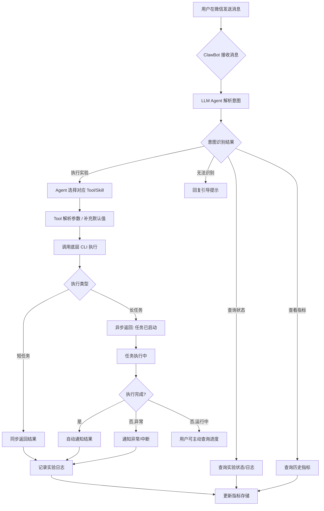
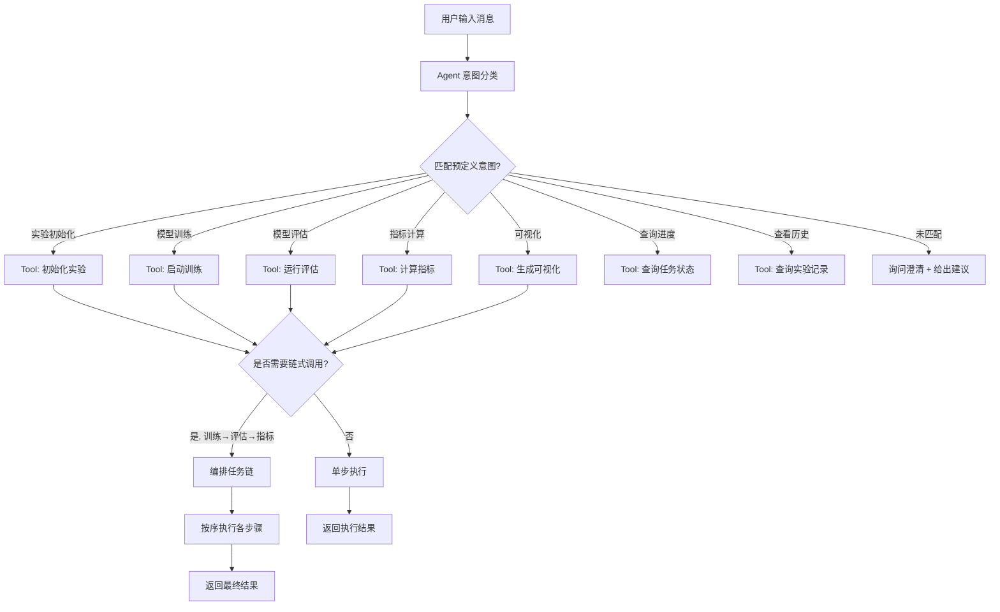
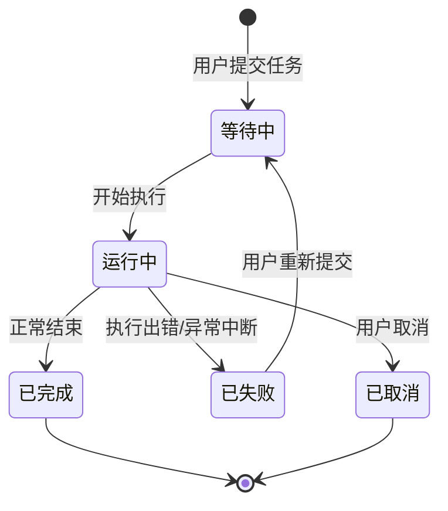
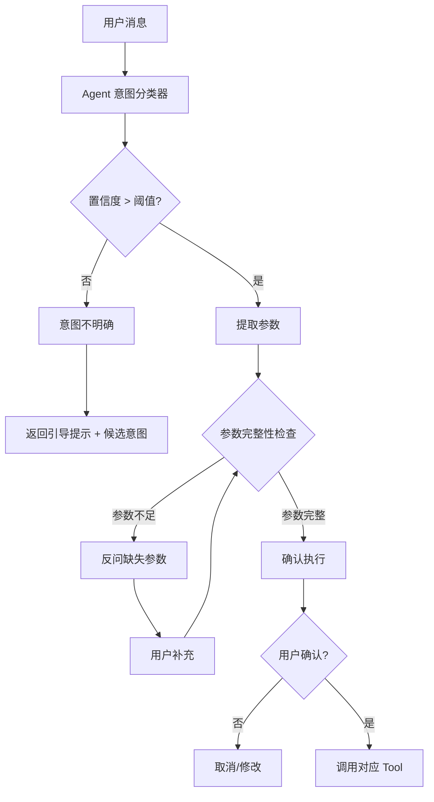
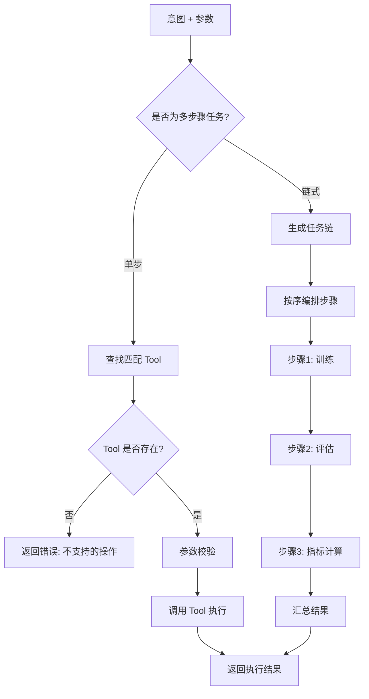
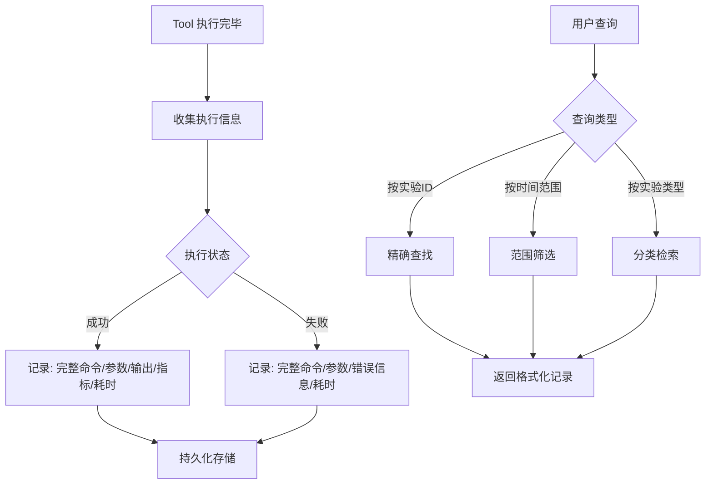
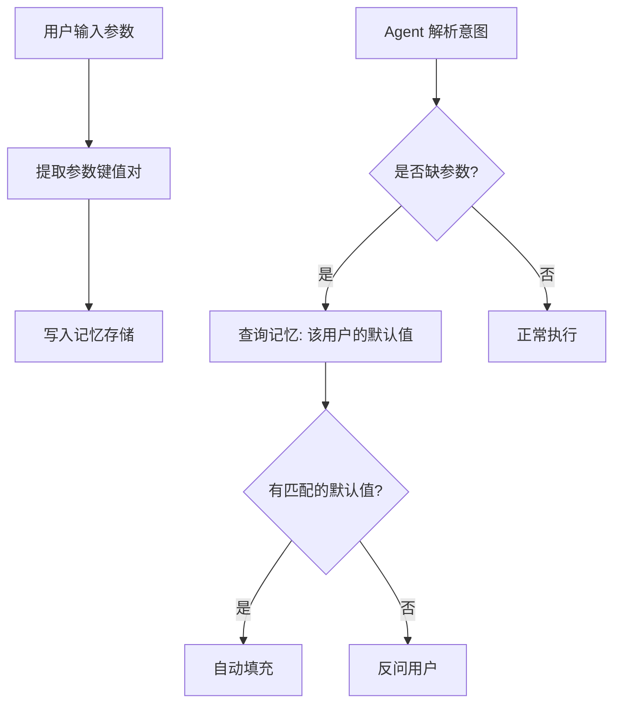
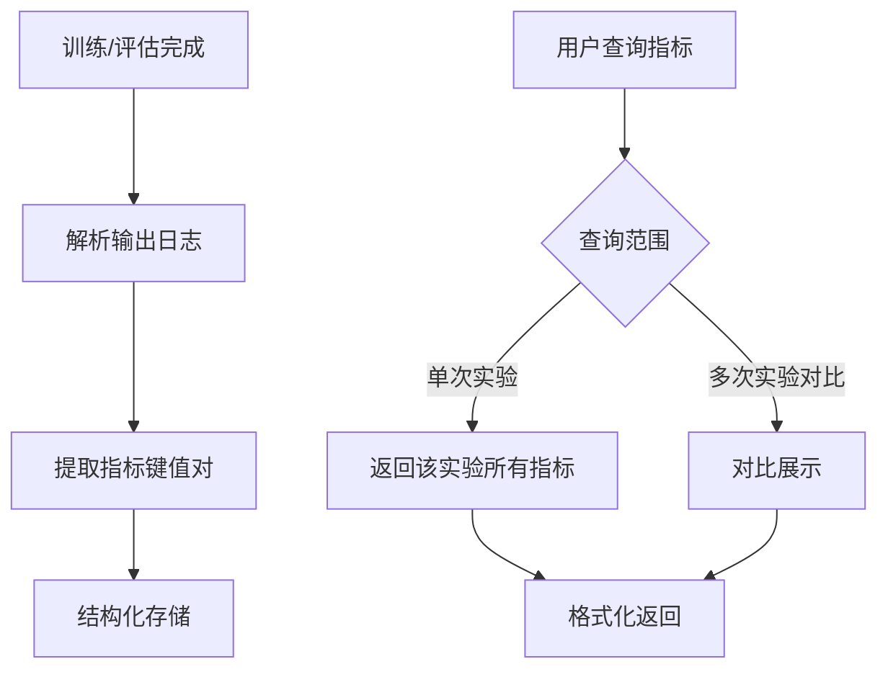

# 基于 Nanobot 的医学三维重建科研实验助手 产品需求文档（PRD）

版本号：V1.0.0

| 版本 | 时间 | 修订人 | 备注 |
|------|------|--------|------|
| V1.0.0 | 2026/05/12 | [待确认] | 创建 V1.0.0 版本 |

---

## 一、概述（为什么做）

### 1.1 产品概述及目标

#### 1.1.1 背景介绍

在医学图像三维重建研究领域，实验流程高度复杂，研究人员面临以下困境：

- **命令行负担重**：每次实验需手动输入 5 个以上命令行参数（数据路径、模型名称、batch size、epoch、checkpoint、GPU 编号等），平均每次实验在参数输入上浪费大量时间
- **实验复现难**：手动记录方式（txt、Excel、截图）分散且不规范，历史结果难以追溯和横向对比
- **流程割裂**：训练、评估、指标计算、可视化依赖多个独立脚本，研究人员需频繁切换终端
- **移动场景空白**：训练周期长达数小时至数天，但缺乏移动端查看状态的能力，异常响应不及时

当前实验室使用 Nanobot 框架与 CLI 工具链，底层医学三维重建算法已成熟，亟需一套将 CLI 调度能力转化为自然语言交互体验的科研实验助手。

#### 1.1.2 产品概述

基于 Nanobot 框架和 LLM Agent 能力，构建一款面向医学三维重建研究的**微信对话式科研实验助手**。用户通过微信发送自然语言指令，即可完成实验配置、启动训练、查看进度、获取指标等全流程操作，无需记忆任何命令行参数。

#### 1.1.3 产品目标

**业务目标**

| 目标 | 指标 | 目标值 | 达成时间 |
|------|------|--------|---------|
| 降低实验操作门槛 | 实验配置效率提升 | 提升 80%+ | 上线后 1 个月 |
| 覆盖主要科研流程 | 支持的科研流程数 | ≥4 种（初始化/训练/评估/可视化） | V1.0 |
| 数据覆盖度 | 支持的医学图像数据 | ≥200 例（X 光 + CT） | V1.0 |
| 用户活跃度 | 微信 ClawBot 日活跃用户 | ≥5 人次（实验环境） | V1.0 |

**用户目标**

| 目标用户 | 用户目标 | 衡量指标 |
|---------|---------|---------|
| 医学图像研究生 | 不用记命令就能快速跑实验 | 单次实验从输入指令到启动耗时 < 30s |
| 实验室导师/组长 | 随时查看学生实验记录，确保可复现 | 实验记录完整率 100% |
| 跨学科合作者 | 用自然语言触发实验，查看结果 | 首次使用无需培训即可完成一次实验 |

#### 1.1.4 目标用户

| 角色 | 描述 | 核心诉求 |
|------|------|---------|
| 医学图像研究生 | 实验室核心研究人员，日常进行三维重建实验 | 简化操作流程，减少重复劳动 |
| 实验室导师/组长 | 负责管理实验进度和质量 | 追踪实验记录，确保可复现性 |
| 跨学科合作者 | 非技术背景的医学/生物合作者 | 用自然语言触发实验，直观获取结果 |

### 1.2 名词说明

| 名词 | 说明 |
|------|------|
| Nanobot | 实验室使用的底层 CLI 工具链框架 |
| ClawBot | Nanobot 内置的微信渠道 Bot 接口，提供微信消息收发能力 |
| Tool/Skill | Agent 可调用的原子能力单元，每个 Tool 封装一个科研步骤（如初始化、训练） |
| LLM Agent | 大语言模型驱动的智能调度模块，解析用户意图并调用对应 Tool |
| Dice 系数 | 医学图像分割领域常用的指标，衡量预测与标注的重叠度 |
| Checkpoint | 模型训练过程中的中间权重保存文件 |

### 1.3 角色及权限

系统不设细粒度权限体系，所有用户默认拥有全部功能的使用权限。

| 角色 | 权限范围 |
|------|---------|
| 所有用户 | 全部功能（实验调度、日志查询、指标查看） |

> **说明**：系统面向同一实验室内部 10-20 人使用，暂无多级权限管理需求。后续如需区分管理员/普通用户角色，可在后续版本迭代。

### 1.4 文档阅读对象

| 对象 | 关注内容 |
|------|---------|
| 研发 | 功能需求、Agent 调度机制、Tool/Skill 设计、数据字典 |
| 测试 | 异常流程、验收标准 |
| 导师/项目负责人 | 产品目标、版本规划、成功标准 |

---

## 二、产品描述（做什么）

### 2.1 产品需求描述

构建一个基于 Nanobot + LLM Agent 的微信对话式科研实验助手，核心能力包括：

- **自然语言 -> 实验执行**：用户在微信中输入自然语言指令，系统自动解析意图、填充参数、调用底层 CLI 执行
- **多步骤任务链**：支持"训练 -> 评估 -> 指标计算"等多步骤任务的链式自动调度
- **实验全程可追溯**：自动记录每次实验的完整参数、输出、指标，支持按条件查询
- **移动端实时掌控**：通过微信随时查看训练进度、GPU 状态、loss 曲线、异常告警

**不做什么：**
- 不提供 Web 管理页面，纯微信对话流交互
- 不修改底层医学三维重建算法，只做调度层封装
- 不涉及用户登录注册体系（复用微信身份）

### 2.2 产品整体流程

#### 2.2.1 主流程



#### 2.2.2 子流程：LLM Agent 意图识别与 Tool 调度



#### 2.2.3 状态转换图（实验任务状态）



### 2.3 全局说明

#### 2.3.1 全局异常处理

| 异常场景 | 处理方式 | 提示文案 |
|---------|---------|---------|
| 输入无法理解 | Agent 回复引导提示，列出支持的命令类型 | "我没理解您的意思，您可以试试这样说：'帮我跑一下X光三维重建训练'、'查看实验进度'、'查看GPU状态'" |
| 参数缺失 | Agent 反问缺失的参数，引导用户补充 | "好的，准备启动训练。请告诉我用哪个数据集？(如：X光/CT)" |
| CLI 执行失败 | 捕获错误输出，返回可读的错误提示 | "训练启动失败，错误原因：[具体原因]。建议：请检查数据集路径是否正确" |
| 训练中 OOM/NaN | 检测到异常后主动推送通知 | "⚠️ 训练异常中断：CUDA out of memory。当前 GPU 显存占用：[X]GB" |
| 长任务超时 | 主动通知用户执行超时 | "任务执行超过预期时间，当前状态：[状态]，是否需要查询最新进度？" |
| 网络异常 | ClawBot 无法连接时，用户消息无法送达；恢复后不重试 | - |

#### 2.3.2 全局交互规则

| 场景 | 交互方式 |
|------|---------|
| 短任务 (≤5s) | 同步返回结果，直接回复执行完成信息 |
| 长任务 (>5s) | 立即回复"任务已启动"，带任务ID；执行完成后主动推送通知 |
| 进度查询 | 用户在任意时刻发送"进度"/"状态"/任务ID，返回当前执行状态 |
| 任务取消 | 用户可发送"取消任务 [任务ID]"终止正在运行的任务 |
| 多轮对话 | Agent 保持上下文，支持追问式补充参数 |
| 帮助引导 | 用户发送"帮助"/"菜单"时，返回支持的命令列表及示例 |

### 2.4 产品版本规划

| 版本 | 范围 | 计划时间 | 状态 |
|------|------|---------|------|
| V1.0 | 核心实验调度（自然语言解析、Agent 调度、4+ Tool/Skill、实验日志记录、结果通知） | [待确认] | 规划中 |
| V1.1 | 长短期记忆系统、实验指标自动计算与对比、GPU 状态查询、异步任务主动推送 | [待确认] | 规划中 |
| V2.0 | 多实验并行调度、可视化结果直接推送、实验结果一键复现、跨用户协作 | [待确认] | 远期 |

### 2.5 产品框架

```
┌─────────────────────────────────────────────────┐
│                微信客户端 (ClawBot)              │
└──────────────────────┬──────────────────────────┘
                       │ 微信消息
┌──────────────────────▼──────────────────────────┐
│           ClawBot 消息网关 (已存在)               │
└──────────────────────┬──────────────────────────┘
                       │
┌──────────────────────▼──────────────────────────┐
│              LLM Agent 调度层                     │
│  ┌──────────┐ ┌──────────┐ ┌──────────────────┐ │
│  │意图解析器 │ │记忆管理器 │ │ 任务编排引擎      │ │
│  │(NL→Intent)│ │(偏好/历史)│ │(链式调用/状态管理)│ │
│  └─────┬────┘ └────┬─────┘ └────────┬─────────┘ │
└────────┼────────────┼────────────────┼───────────┘
         │            │                │
┌────────▼────────────▼────────────────▼───────────┐
│              Tool/Skill 执行层                    │
│  ┌──────┐ ┌──────┐ ┌──────┐ ┌──────┐ ┌──────┐  │
│  │初始化 │ │训练  │ │评估  │ │指标  │ │可视化│  │
│  │Tool  │ │Tool  │ │Tool  │ │Tool  │ │Tool  │  │
│  └──┬───┘ └──┬───┘ └──┬───┘ └──┬───┘ └──┬───┘  │
└─────┼────────┼────────┼────────┼────────┼───────┘
      │        │        │        │        │
┌─────▼────────▼────────▼────────▼────────▼───────┐
│              Nanobot CLI + 底层算法              │
│    (train.py / eval.py / metrics.py / visualize) │
└─────────────────────────────────────────────────┘
```

### 2.6 功能清单

| 模块 | 功能 | 优先级 | 版本 | 说明 |
|------|------|--------|------|------|
| 实验调度 | 自然语言意图解析 | P0 | V1.0 | 识别用户意图并映射到对应 Tool |
| 实验调度 | 参数自动填充 | P0 | V1.0 | 从用户输入自动提取参数 + 补充默认值 |
| 实验调度 | Tool/Skill 调度 | P0 | V1.0 | Agent 根据意图调用对应 Tool 执行 |
| 实验调度 | 多步骤任务链 | P1 | V1.1 | 支持"训练→评估→指标"链式调度 |
| Tool 能力 | 实验初始化 Tool | P0 | V1.0 | 初始化实验环境、数据路径、配置文件 |
| Tool 能力 | 模型训练 Tool | P0 | V1.0 | 启动模型训练，支持指定数据集/参数 |
| Tool 能力 | 模型评估 Tool | P0 | V1.0 | 运行评估流程，计算 Dice 等指标 |
| Tool 能力 | 指标计算 Tool | P1 | V1.0 | 解析训练日志，自动计算并存储指标 |
| Tool 能力 | 可视化 Tool | P1 | V1.1 | 生成 loss 曲线、分割结果可视化 |
| 记忆系统 | 用户偏好记忆 | P1 | V1.1 | 记住用户的默认路径、常用超参数等 |
| 记忆系统 | 跨会话识别 | P2 | V2.0 | 长期用户画像 |
| 日志追踪 | 实验记录自动存储 | P0 | V1.0 | 每次实验的完整命令、参数、输出 |
| 日志追踪 | 历史记录查询 | P0 | V1.0 | 按实验 ID/时间范围/类型查询 |
| 日志追踪 | 可读错误提示 | P0 | V1.0 | CLI 错误信息转换为用户友好的中文提示 |
| 状态通知 | 异步任务进度查询 | P0 | V1.0 | 用户主动查询任务执行状态 |
| 状态通知 | 完成/异常主动推送 | P1 | V1.1 | 任务结束或异常时自动通知用户 |
| 状态通知 | GPU 状态查询 | P1 | V1.1 | 查看当前 GPU 占用率、显存使用 |
| 系统集成 | 微信 ClawBot 接入 | P0 | V1.0 | 复用已有 ClawBot 接口收发消息 |

---

## 三、功能需求（怎么做）

### 3.1 自然语言实验调度模块

#### 3.1.1 描述

用户通过微信发送自然语言消息，系统自动解析意图、提取参数、调度对应 Tool 执行实验。这是整个系统的核心入口。

#### 3.1.2 用户故事

```
作为 医学图像研究生，我希望 用自然语言描述我想做的实验，以便 不用记忆复杂的命令行参数。
作为 跨学科合作者，我希望 用日常语言说出需求就能触发实验，以便 无需学习 CLI 工具。
```

#### 3.1.3 前置条件

| 类型 | 条件 |
|------|------|
| 系统依赖 | ClawBot 正常运行，微信消息通道畅通 |
| 数据依赖 | 目标数据集已存在于服务器指定路径 |
| 功能依赖 | 底层 CLI 工具链已安装配置 |

#### 3.1.4 后置条件

- 系统解析结果（意图 + 参数）传递给对应 Tool
- 开始执行后实验日志记录写入存储
- 用户收到执行结果或任务已启动的回复

#### 3.1.5 界面及交互

交互载体为微信聊天窗口，所有交互通过文本消息完成。

| 元素 | 说明 |
|------|------|
| 用户输入 | 自然语言消息，支持中文 |
| 系统回复 | 文本消息，格式化为分段结构，关键信息(如任务ID)加粗或单独成行 |
| 示例输入 | "帮我跑一下X光图像的三维重建训练" |
| | "用CT数据集训练一个模型，batch size设8，跑50个epoch" |
| | "看看上次实验的指标" |
| | "当前GPU占用怎么样" |
| 引导回复 | 当输入无法理解时，返回支持的指令列表和示例 |

#### 3.1.6 业务流程



#### 3.1.7 异常/分支流程

| 场景 | 触发条件 | 处理方式 | 提示文案 |
|------|---------|---------|---------|
| 意图无法识别 | 输入内容与所有预定义意图不匹配 | 返回引导菜单，列出支持的功能 | "我没理解您的意思。您可以试试：'训练CT模型'、'查看进度'、'GPU状态'" |
| 参数提取失败 | 输入中缺少关键参数 | Agent 反问最必要的缺失参数 | "已识别到需要启动训练，请告诉我使用哪个数据集？(X光/CT)" |
| 多意图冲突 | 一条消息包含多个不兼容的意图 | 请求用户确认优先级 | "您提到了训练和评估，请问要先执行哪一个？还是需要按顺序执行？" |
| 用户取消 | 用户发送"取消"或"算了" | 取消当前任务/对话 | "已取消当前操作" |
| 不支持的实验类型 | 用户要求做三维重建以外的事情 | 说明能力边界 | "目前我专注于医学三维重建实验，暂不支持其他类型的任务" |

#### 3.1.8 数据字典

**意图解析结果结构**

| 字段名 | 类型 | 必填 | 说明 | 示例值 |
|--------|------|------|------|--------|
| intent | Enum | 是 | 识别到的意图类型 | "training" |
| confidence | Float | 是 | 置信度分数 (0-1) | 0.95 |
| params | Object | 否 | 提取到的参数键值对 | {"dataset": "CT", "batch_size": 8} |
| missing_params | String[] | 否 | 缺失的必要参数列表 | ["epoch"] |
| raw_input | String | 是 | 用户原始输入 | "帮我跑一下CT训练" |

### 3.2 Tool/Skill 调度引擎

#### 3.2.1 描述

Agent 根据解析出的意图，选择合适的 Tool/Skill 执行科研任务。支持单步执行和链式调用。

#### 3.2.2 用户故事

```
作为 系统，我希望 根据用户意图自动选择正确的 Tool，以便 用户无需关心底层调用细节。
作为 研发人员，我希望 能够方便地新增 Tool，以便 扩展系统支持的科研流程。
```

#### 3.2.3 Tool 定义规范

每个 Tool 包含以下元数据：

| Tool 名称 | 触发意图 | 描述 | 必填参数 | 可选参数 | 执行类型 |
|-----------|---------|------|---------|---------|---------|
| 实验初始化 | `init` | 初始化实验环境，创建实验目录、配置文件 | `dataset` | `experiment_name` | 短任务 |
| 模型训练 | `training` | 启动模型训练 | `dataset`, `model` | `batch_size`, `epoch`, `checkpoint`, `gpu_id` | 长任务 |
| 模型评估 | `evaluation` | 对指定 checkpoint 运行评估 | `dataset`, `checkpoint` | `model` | 长任务 |
| 指标计算 | `metrics` | 解析训练日志，计算 Dice 等指标 | `experiment_id` | - | 短任务 |
| 可视化生成 | `visualize` | 生成 loss 曲线或分割结果图 | `experiment_id` | `type`(loss/segmentation) | 短任务 |
| 状态查询 | `status` | 查询任务执行状态 | - | `task_id` | 短任务 |
| 历史查询 | `history` | 查询历史实验记录 | - | `start_time`, `end_time`, `experiment_id` | 短任务 |
| GPU 状态 | `gpu_status` | 查看当前 GPU 资源使用情况 | - | - | 短任务 |

#### 3.2.4 业务流程



#### 3.2.5 异常/分支流程

| 场景 | 触发条件 | 处理方式 |
|------|---------|---------|
| Tool 执行失败 | CLI 返回非零退出码 | 捕获错误输出，转换为用户友好的中文提示 |
| 链式中断 | 链中某步骤失败 | 立即停止后续步骤，通知用户失败步骤及原因，提供重试选项 |
| 参数校验失败 | 参数类型/范围不合法 | 返回具体哪个参数有问题及期望格式 |
| Tool 不可用 | 依赖的工具未安装 | 提示缺少依赖及安装方式 |
| 并发冲突 | 同一用户多次提交训练 | 提示当前已有任务在运行，确认是否覆盖或排队 |

#### 3.2.6 数据字典

**Tool 注册表**

| 字段名 | 类型 | 必填 | 说明 | 示例值 |
|--------|------|------|------|--------|
| tool_name | String(50) | 是 | Tool 唯一标识 | "training" |
| display_name | String(100) | 是 | 显示名称 | "模型训练" |
| description | String(500) | 是 | 功能描述 | "启动医学三维重建模型训练" |
| trigger_intents | String[] | 是 | 可触发的意图列表 | ["training", "train", "run"] |
| required_params | ParamDef[] | 是 | 必填参数定义 | [见下方] |
| optional_params | ParamDef[] | 否 | 可选参数定义 + 默认值 | [见下方] |
| exec_type | Enum | 是 | sync(短任务)/async(长任务) | "async" |
| chainable | Bool | 是 | 是否支持链式调用 | true |

**参数定义 (ParamDef)**

| 字段名 | 类型 | 必填 | 说明 | 示例值 |
|--------|------|------|------|--------|
| name | String | 是 | 参数名 | "batch_size" |
| type | Enum | 是 | 参数类型 | "int" |
| description | String | 是 | 描述 | "批次大小" |
| default | Any | 否 | 默认值 | 8 |
| required | Bool | 是 | 是否必填 | false |
| validation | String | 否 | 校验规则 | ">0, <=128" |

### 3.3 日志追踪与结果追溯

#### 3.3.1 描述

自动记录每次实验的完整信息（命令、参数、输出、指标），支持按条件查询和追溯。

#### 3.3.2 用户故事

```
作为 实验室导师，我希望 查看学生的实验记录，以便 确认实验是否可复现。
作为 研究生，我希望 对比不同参数组合的实验结果，以便 找出最优配置。
```

#### 3.3.3 前置条件

| 类型 | 条件 |
|------|------|
| 功能依赖 | Tool 执行完成后自动触发日志写入 |
| 数据依赖 | 日志存储系统已初始化 |

#### 3.3.4 业务流程



#### 3.3.5 异常/分支流程

| 场景 | 触发条件 | 处理方式 |
|------|---------|---------|
| 日志写入失败 | 存储不可用 | 返回执行结果但不记录日志，提示用户存储异常 |
| 查询无结果 | 无匹配记录 | 返回"未找到相关实验记录" |
| 大量结果 | 匹配记录过多 | 分页返回，默认最近 10 条，提示用户缩小范围 |

#### 3.3.6 数据字典

**实验记录 (ExperimentRecord)**

| 字段名 | 类型 | 必填 | 说明 | 示例值 |
|--------|------|------|------|--------|
| experiment_id | String(36) | 是 | 唯一实验 ID (UUID) | "exp_a1b2c3d4" |
| user_id | String(100) | 是 | 用户标识 (微信 ID) | "wx_xxxxxxxx" |
| intent | String(50) | 是 | 意图类型 | "training" |
| tool_name | String(50) | 是 | 调用的 Tool | "training" |
| command | String(1000) | 是 | 完整的 CLI 命令 | "python train.py --dataset CT --batch 8" |
| params | JSON | 是 | 参数键值对 | {"dataset":"CT","batch_size":8} |
| output | Text | 否 | 标准输出内容 | "Epoch 1/50, loss: 0.2345..." |
| error | Text | 否 | 错误输出 (失败时) | "CUDA out of memory" |
| status | Enum | 是 | 执行状态: success/failed/running | "success" |
| metrics | JSON | 否 | 计算的指标结果 | {"dice": 0.87, "loss": 0.12} |
| started_at | DateTime | 是 | 开始时间 | 2026-05-12 14:30:00 |
| finished_at | DateTime | 否 | 结束时间 | 2026-05-12 15:45:00 |
| duration_sec | Int | 否 | 执行耗时 (秒) | 4500 |

### 3.4 记忆系统

#### 3.4.1 描述

系统记录用户的实验偏好（默认数据集路径、常用超参数等），在后续对话中主动复用，减少重复输入。

#### 3.4.2 用户故事

```
作为 研究生，我希望 系统记住我的常用设置，以便 每次实验不用重复输入相同参数。
```

#### 3.4.3 记忆内容

| 记忆类型 | 内容 | 示例 | 来源 |
|---------|------|------|------|
| 用户偏好 | 默认数据集路径 | "/data/CT" | 用户历史使用中自动提取 |
| 用户偏好 | 常用 batch size | 8 | 用户频繁使用的值 |
| 用户偏好 | 默认 GPU 编号 | 0 | 用户首次指定后记录 |
| 会话上下文 | 当前正在讨论的实验 | "CT 训练任务 exp_a1b2c3d4" | 当前对话 |
| 历史偏好 | 常用模型类型 | "Unet3D" | 跨会话统计 |

#### 3.4.4 业务流程



#### 3.4.5 异常/分支流程

| 场景 | 触发条件 | 处理方式 |
|------|---------|---------|
| 记忆读取失败 | 存储不可用 | 忽略记忆，按无默认值流程处理 |
| 记忆过期 | 上次使用距今超过 30 天 | 标记为过期，询问用户是否仍使用该默认值 |
| 默认值冲突 | 用户显式输入与默认值不同 | 以用户最新输入为准，更新记忆 |

### 3.5 微信 ClawBot 集成

#### 3.5.1 描述

复用 Nanobot 中已集成的 ClawBot 微信接口，实现用户消息接收和系统消息推送。

#### 3.5.2 交互方式

| 方向 | 方式 | 说明 |
|------|------|------|
| 用户 -> 系统 | ClawBot 消息回调 | 用户发送的微信消息通过 ClawBot 网关传入系统 |
| 系统 -> 用户 | ClawBot 消息发送 | 系统通过 ClawBot API 回复文本消息 |
| 主动推送 | ClawBot 消息发送 | 长任务完成/异常时主动向用户推送通知 |

#### 3.5.3 消息格式

```json
{
  "type": "text",
  "content": "回复消息内容",
  "to_user": "wx_user_id",
  "timestamp": 1700000000
}
```

#### 3.5.4 异常/分支流程

| 场景 | 触发条件 | 处理方式 |
|------|---------|---------|
| ClawBot 离线 | 微信接口不可用 | 系统重试 3 次，仍失败则记录日志，不丢消息 |
| 消息发送失败 | 频率限制/网络问题 | 排队重试，记录失败日志 |
| 长消息 | 回复内容超过微信长度限制 | 自动分段发送，在末尾标注"1/3、2/3、3/3" |
| 用户无响应 | 反问后长时间未回复 | 超时 5 分钟后取消当前对话上下文，不影响正在执行的任务 |

### 3.6 科研指标自动计算

#### 3.6.1 描述

自动解析训练日志中的关键指标（Dice 系数、损失值等），结构化存储并支持对比展示。

#### 3.6.2 用户故事

```
作为 研究生，我希望 训练完成后自动得到指标结果，以便 不用手动从日志中找数据。
作为 实验室导师，我希望 对比不同实验的指标，以便 判断模型效果好坏。
```

#### 3.6.3 支持的指标

| 指标名称 | 说明 | 来源 |
|---------|------|------|
| Dice 系数 | 分割结果与标注的重叠度 | 评估日志 |
| Loss 值 | 训练损失，含每 epoch 值 | 训练日志 |
| IoU | 交并比 | 评估日志 |
| 准确率 | 像素级分类准确率 | 评估日志 |
| 训练耗时 | 每个 epoch 平均耗时 | 训练日志 |

#### 3.6.4 业务流程



#### 3.6.5 数据字典

**指标记录 (MetricsRecord)**

| 字段名 | 类型 | 必填 | 说明 | 示例值 |
|--------|------|------|------|--------|
| experiment_id | String(36) | 是 | 关联的实验 ID | "exp_a1b2c3d4" |
| metric_name | String(50) | 是 | 指标名称 | "dice" |
| metric_value | Float | 是 | 指标值 | 0.8723 |
| epoch | Int | 否 | 所在 epoch | 50 |
| step | Int | 否 | 所在 step | 10000 |
| recorded_at | DateTime | 是 | 记录时间 | 2026-05-12 15:45:00 |

---

## 四、非功能需求（注意事项）

### 4.1 安全与合规

| 需求 | 说明 |
|------|------|
| 数据访问控制 | 实验数据仅限实验室内部服务器访问，不通过微信传输原始数据 |
| 命令安全 | 对用户输入进行注入检测，防止通过自然语言注入非法 CLI 命令 |
| 日志隐私 | 实验日志存储在实验室内部服务器，不经过第三方云服务 |
| 合规要求 | 医学图像数据符合实验室数据管理规定，不通过微信发送原始图像 |

### 4.2 统计需求（埋点）

| 事件名 | 触发时机 | 属性 | 说明 |
|--------|---------|------|------|
| msg_received | 收到用户消息 | user_id, msg_type, length | 消息接收统计 |
| intent_parsed | 意图解析完成 | intent, confidence, raw_input_hash | 意图识别统计 |
| tool_invoked | Tool 被调用 | tool_name, params_hash | Tool 使用频率统计 |
| exec_success | 执行成功 | tool_name, duration_sec | 成功率统计 |
| exec_failed | 执行失败 | tool_name, error_type | 失败率统计 |
| metrics_calculated | 指标计算完成 | experiment_id, metric_count | 指标计算统计 |
| active_push | 主动推送通知 | push_type (完成/异常) | 通知统计 |

### 4.3 性能需求

| 指标 | 要求 |
|------|------|
| 意图识别响应 | 从收到消息到回复 < 3s（不含任务执行时间） |
| 短任务执行 | ≤5s 内返回结果 |
| 状态查询响应 | ≤2s |
| 并发支持 | 支持 5 人同时使用 |
| 可用性 | 工作日 9:00-21:00 可用，训练任务不受影响 |

### 4.4 数据存储

| 数据类型 | 存储方式 | 保留周期 | 清理策略 |
|---------|---------|---------|---------|
| 实验记录 | 本地文件 / 轻量数据库 (SQLite) | 永久保留 | 手动归档 |
| 用户偏好 | JSON 文件 | 长期 | 30 天未使用标记过期 |
| 训练日志 | 文件系统 | 与实验记录关联 | 按实验删除 |
| 指标数据 | 结构化存储 | 永久保留 | 手动归档 |

### 4.5 系统集成

| 对接系统 | 接口方向 | 协议 | 说明 |
|---------|---------|------|------|
| Nanobot CLI | 调用 | 本地进程调用 | 通过 subprocess 执行 CLI 命令 |
| ClawBot 微信网关 | 双向 | HTTP/内部 API | 接收和发送微信消息（已有接口） |
| 文件系统 | 读写 | 本地 I/O | 读取数据集、写入日志和结果 |

---

## 五、附录

### 5.1 验收标准与测试要点

| 功能 | 验收条件 | 优先级 |
|------|---------|--------|
| 自然语言调度 | 输入"帮我跑一下CT训练"后，Agent 正确解析为 training 意图并启动训练 | P0 |
| 自然语言调度 | 输入"查一下上次实验的Dice系数"后，返回最近的指标结果 | P0 |
| 自然语言调度 | 输入无关内容（如"今天天气怎么样"），返回引导提示 | P0 |
| 参数自动填充 | 输入"训练模型，batch size=8"，参数 batch_size=8 正确传递到 CLI | P0 |
| 参数缺失反问 | 输入"训练模型"但没有指定数据集，系统反问"请告诉我使用哪个数据集" | P0 |
| Tool 调度 | 训练 Tool 成功调用底层 train.py，传入正确参数 | P0 |
| Tool 调度 | Tool 执行失败时，返回可读的错误提示而非原始报错 | P0 |
| 误差处理 | 训练中 CUDA OOM，系统主动推送异常通知 | P1 |
| 日志记录 | 每次实验执行后，能在存储中找到完整的实验记录 | P0 |
| 日志查询 | 按实验 ID 查询返回正确的记录，按时间范围查询返回筛选后的列表 | P0 |
| 记忆系统 | 用户第一次指定"数据集路径为 /data/CT"后，下次训练默认使用该路径 | P1 |
| 微信集成 | 通过 ClawBot 发送的消息能正确到达系统，系统回复能正确推送到用户微信 | P0 |
| 指标计算 | 训练完成后自动解析并存储 Dice 系数 | P1 |
| GPU 状态 | 发送"GPU状态"，返回当前 GPU 占用、显存使用情况 | P1 |
| 长消息分段 | 回复超出微信长度限制时，自动分段发送并标注序号 | P1 |

### 5.2 待确认项清单

#### 必须确认（阻塞开发）

| # | 内容 | 对应章节 |
|---|------|---------|
| 1 | [待确认] 具体的技术栈选型：LLM Agent 使用哪个模型？（如 GPT-4、本地部署的 Qwen、DeepSeek 等） | 3.2 |
| 2 | [待确认] 实验记录的存储方式：使用 SQLite 还是文件系统？ | 4.4 |
| 3 | [待确认] ClawBot 对接的具体接口协议细节（消息格式、认证方式、频率限制） | 3.5 |

#### 建议确认（影响完整度）

| # | 内容 | 对应章节 |
|---|------|---------|
| 4 | [待确认] 版本规划的时间节点：V1.0 预期何时上线？ | 2.4 |
| 5 | [待确认] 是否需要支持多 GPU 自动分配 / 排队机制？ | 3.2.5 |
| 6 | [待确认] 长任务主动推送的轮询频率（如每 30s/60s 检查一次状态） | 3.5 |
| 7 | [待确认] 记忆系统是否跨用户共享默认值，还是每个用户独立？ | 3.4 |

#### 可后续补充

| # | 内容 | 对应章节 |
|---|------|---------|
| 8 | [待确认] 是否需要实验报告的自动生成和导出功能？ | 2.6 |
| 9 | [待确认] 是否需要支持定时实验（如凌晨自动运行）？ | 2.6 |
| 10 | [待确认] 具体部署环境（服务器配置、CUDA 版本、Python 版本等） | - |
